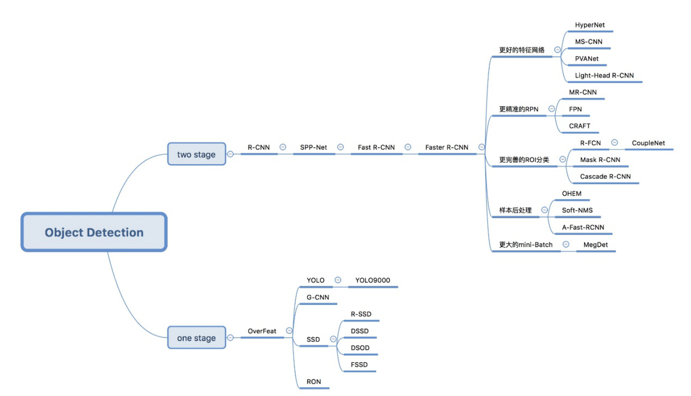

| 深度网络名                | 年份 | 作者                    | 描述                                        |
| ------------------------- | ---- | ----------------------- | ------------------------------------------- |
| LeNet                     | 1994 | Yann LeCun              | 简单卷积神经网                              |
| AlexNet                   | 2012 | Alex Krizhevsky         | 2012届图像识别大赛的冠军                    |
| ZFNet                     | 2013 | Matthew D Zeiler        | 可视化                                      |
| Net in Net                | 2013 | Lin M                   | 网络嵌套模型                                |
| VGGNet                    | 2014 | 牛津大学的视觉几何组    | ILSVRC-2014中定位任务第一名和分类任务第二名 |
| GoogLeNet                 | 2014 | Google                  | ILSVRC14 比赛中获得冠军                     |
| Inception-v2/v3           | 2015 | Google                  | 小卷积代替大大卷积                          |
| ResNet                    | 2015 | MSRA 何凯明团队         |                                             |
| Stochastic_Depth          | 2016 | Gao Huang               | 随机深度                                    |
| Wide ResNet               | 2016 | Sergey Zagoruyko        | 考虑宽度网络性能                            |
| Inception-ResNet V1/V2/V3 | 2016 | Google                  | 融合 resnet 和 inception 结构的网络         |
| ResNet in ResNet          | 2016 | Sasha Targ              | 泛化的 resnet 网络结构                      |
| Fractalnet                | 2016 | Gustav Larsson          | 分形结构                                    |
| ResNeXt                   | 2016 | Saining Xie             | 减少参数                                    |
| DenseNet                  | 2017 | Gao Huang               | 稠密网络                                    |
| DPN                       | 2017 | 颜水成                  | 结合 resnet 和 densenet                     |
| PyramidNet                | 2017 | Dongyoon Han            | 金字塔+resnet 网络                          |
| SqueezeNet                | 2017 | 伯克利&斯坦福的研究人员 | 网络压缩                                    |
| MobileNet V1/V2           | 2017 | Google                  | 精简网络                                    |
| ShuffleNet                | 2017 | 旷视科技                | 精简网络                                    |
| SENet                     | 2017 | Momenta                 | 精简网络+imageNet2017 冠军                  |

