**Caffe 中的卷积层，代码如下：**

```python
layer {
  name: "conv1" // 该层的名字
  type: "Convolution" // 该层的类型，具体地，可选的类型有：Convolution、
  bottom: "data" // 该层的输入数据Blob的名字
  top: "conv1" // 该层的输出数据Blob的名字
  // 该层的权值和偏置相关参数
  param { 
    lr_mult: 1  //weight的学习率
  }
  param {
    lr_mult: 2  // bias的学习率
  }
  // 该层（卷积层）的卷积运算相关的参数
  convolution_param {
    num_output: 20
    kernel_size: 5
    stride: 1
    weight_filler {
      type: "xavier"  // weights初始化方法
    }
    bias_filler {
      type: "constant" // bias初始化方法
    }
  }
}
```

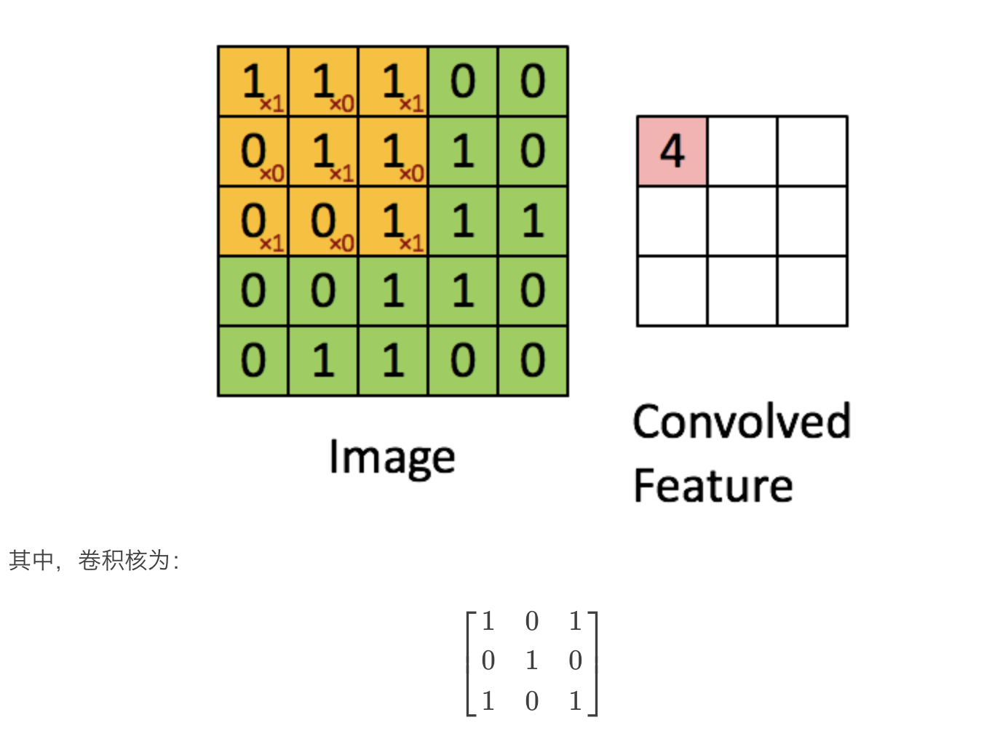

在数字图像处理中，通过卷积操作可以完成很多任务，比如滤波去噪、边缘检测、图像锐化等等，其中，卷积核（算子）是实现各种图像处理任务的关键，比如，均值滤波的卷积核就是均匀权重值：

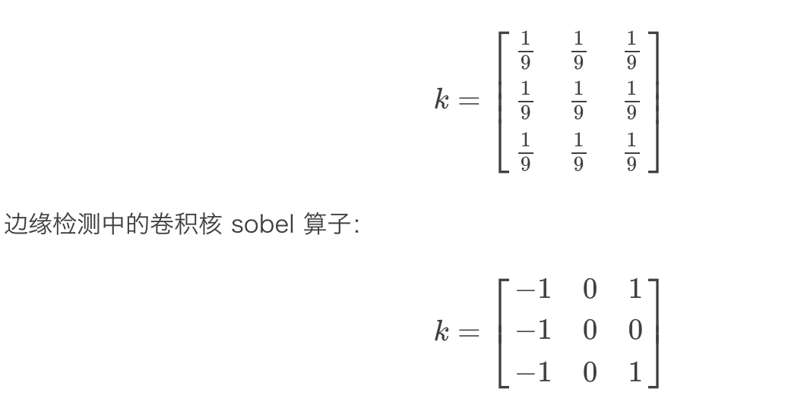


**深度学习中卷积层的目的就是利用不同类型的卷积核（滤波器）来抽取图像中的不同特征。** 每一种不同的卷积核，都对应到一种不同的特征, 在实际工程中使用卷积，经常会涉及到两个概念：边缘效应和感受野。

- **边缘效应**

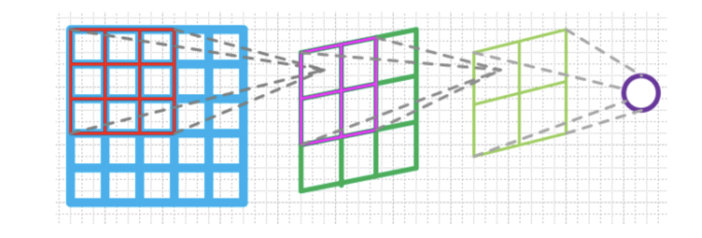

经过卷积运算以后，Feature Map 大小从 5×5 变成了 3×3。这就是所谓的边缘效应。它会带来两个问题：

1. 图像越来越小；
2. 图像边界信息丢失，即有些图像角落和边界的信息发挥作用较少。


- **感受野**

感受野，即卷积神经网络的每一层输出的特征图（Feature Map）上的像素点在原图像上映射的区域大小。对于单层网络来说，下一层的一个像素点其感受野大小也就是卷积层滤波器的大小。

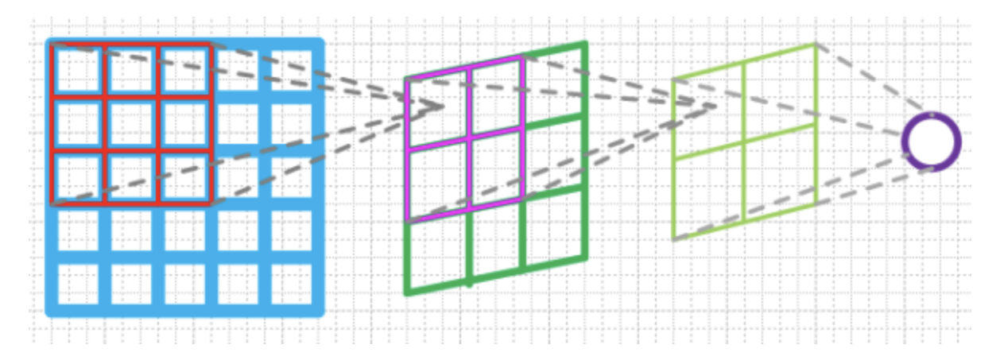

对于网络更深层的感受野，可以通过如下迭代公式计算：

V′receptivefield=((Vreceptivefield−1)∗stride)+Sizeconv

在实际工程中，设计网络结构时，灵活运用感受野可以有效减少网络计算量，以 Google 提出的 Inception 系列为例，采用多个小卷积核代替大卷积核和采用 1×n 和 n×1 的卷积核来代替 n×n 的卷积核，均可以采用感受野的相关知识来进行解释。另外，空洞卷积的设计和使用，同样也是基于增大感受野为目的而设计的卷积结构


**实际产品算法设计中，常用的几种标准卷积结构对比和设计原则**

- 堆叠结构

典型网络结构为 VGG，采用一系列小卷积核来代替大卷积核，比如：2个 3×3 卷积核对应一个 5×5 卷积核感受野；3个 3×3 卷积核对应一个 7×7 卷积核感受野，如下图所示。

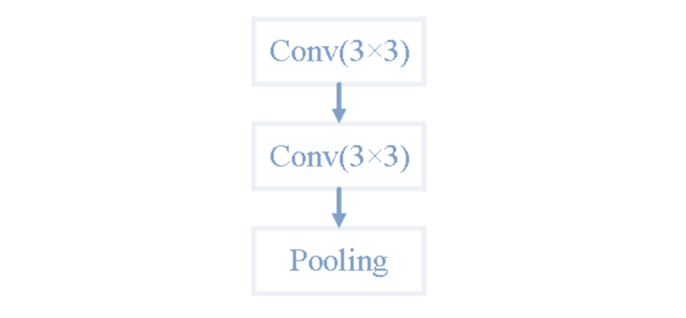

- 跳连结构

典型网络结构为 ResNet 网络，采用残差结构来增大梯度，尽可能减少梯度消失问题。其中使用 1×1 卷积核来完成图像减少通道和增加通道的目的，进而减少计算量，如下图所示。

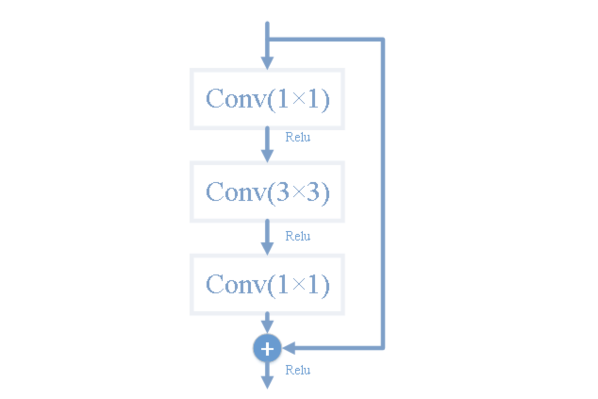

- Inception 结构

典型的网络结构为 Google 提出的 Inception 系列网络，这种网络结构的特点就在于通过不同尺度的卷积核来学习不同感受野下的特征，并且能够在一定程度上增大网络的宽度（通道数）。

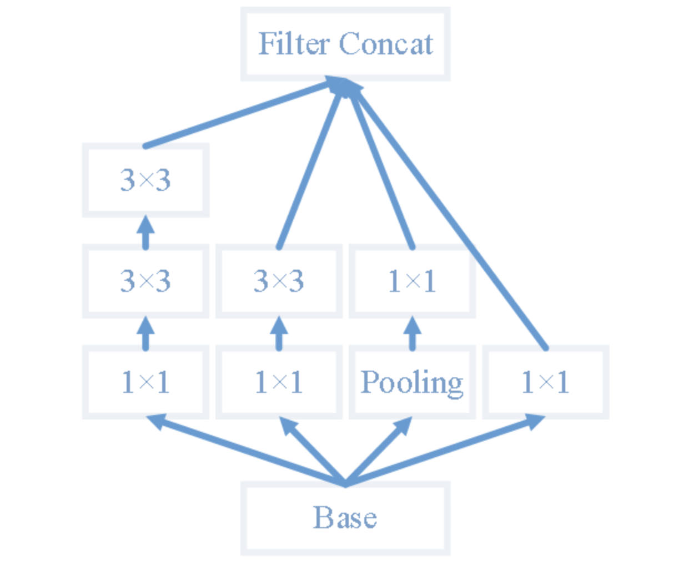

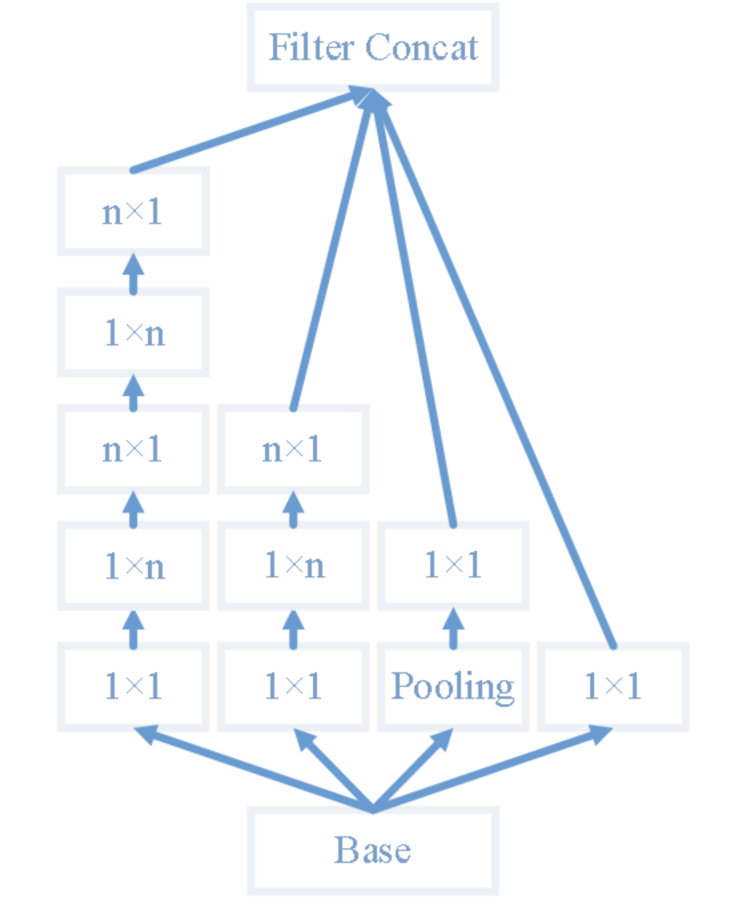

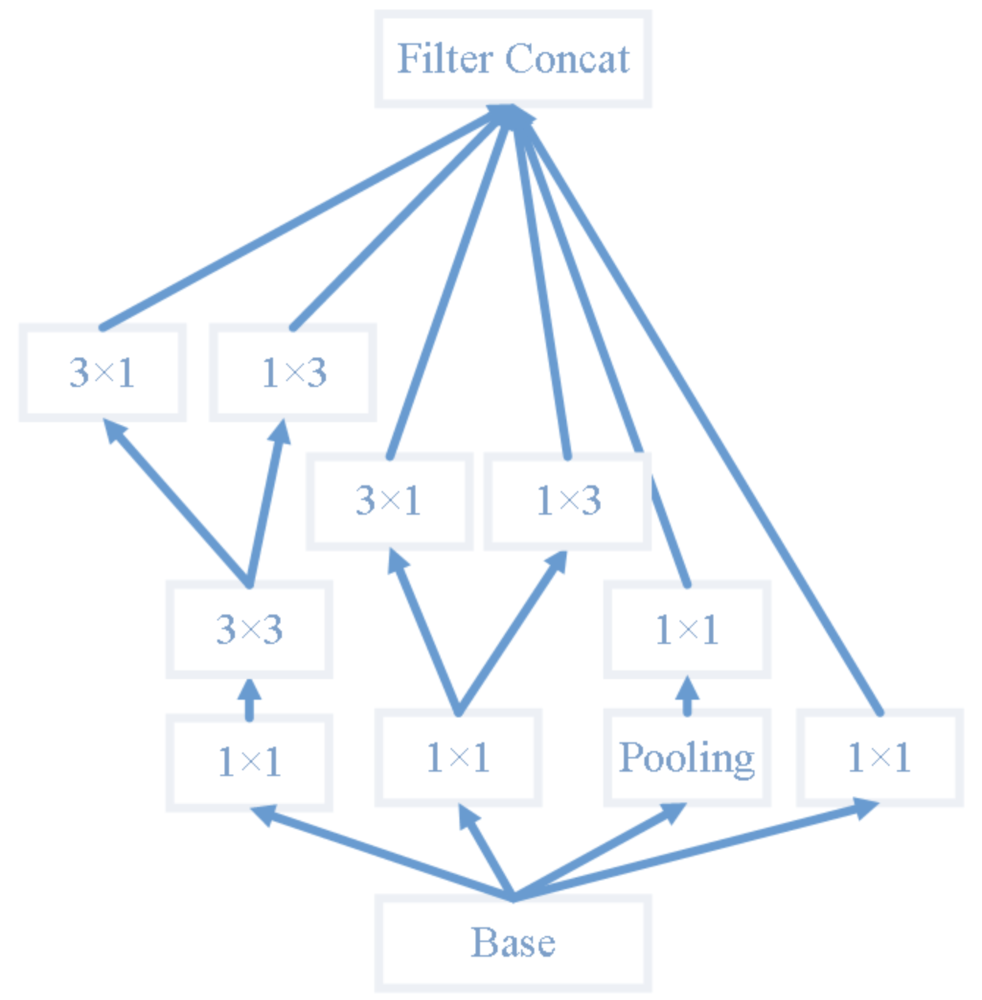

几点关于标准卷积设计原则：

1. 第一层可以采用大卷积核，选择较大的感受野（第一层为3通道，使用大卷积核计算量也可以接受）；
2. 除第一层，其它层尽量使用小卷积核：比如 3×3、5×5 卷积核；
3. 不要使用 2×2、4×4 这样的偶数大小卷积核；
4. 使用 1×1 卷积核来减少通道数，减小计算量，增加非线性；
5. 使用 1×n 和 n×1 的卷积核代替 n×n 卷积核，减小计算量，增加非线性；
6. Tensorflow 提供 3D 卷积操作，效果大多会优于 2D 卷积。


**Caffe 中卷积源码实现解读**

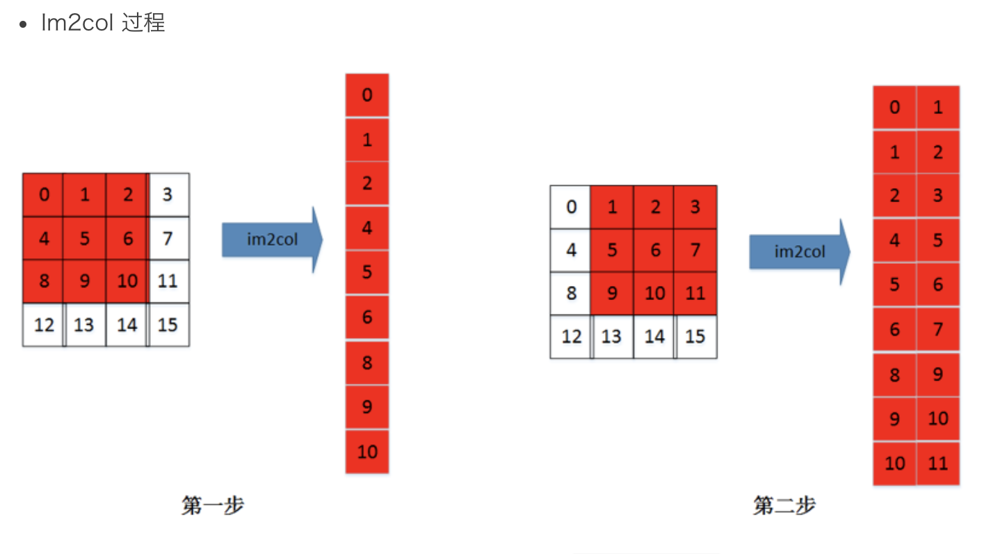

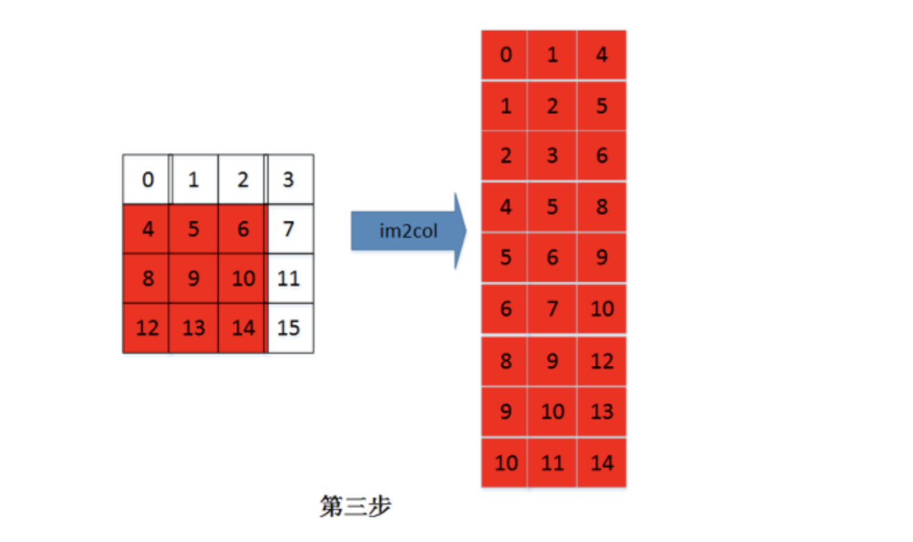

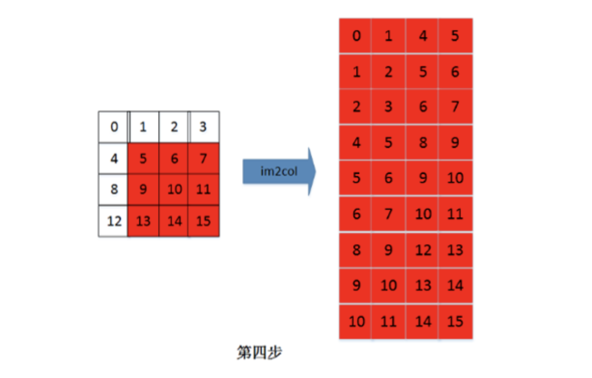


多通道计算过程：

假设有三个通道（R、G、B）图像通道 `input_channel=3`，图像在内存中的存储是：首先是连续存储第一通道的数据，然后再存储第二通道的数据，最后存储第三通道的数据。如下图：

step=1

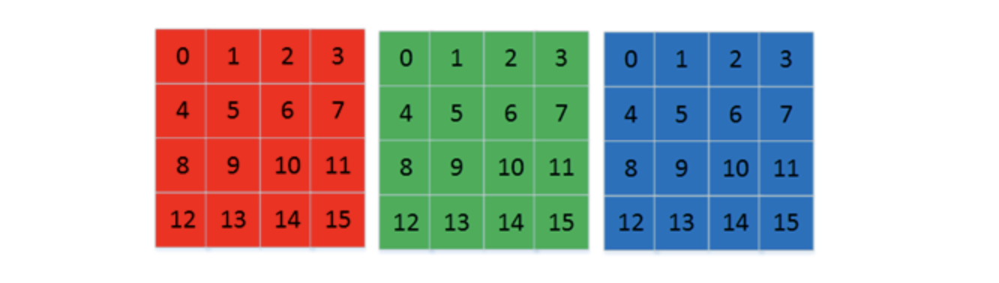

多通道的 im2col 的过程，是首先 im2col 第一通道，然后再 im2col 第二通道，最后 im2col 第三通道。各通道 im2col 的数据在内存中也是连续存储的。 

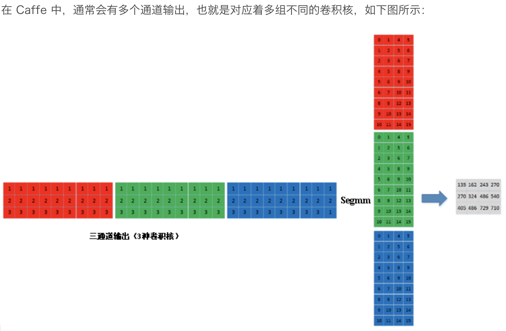


