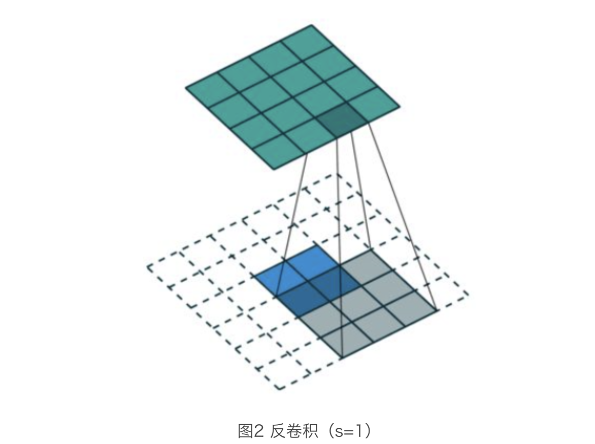
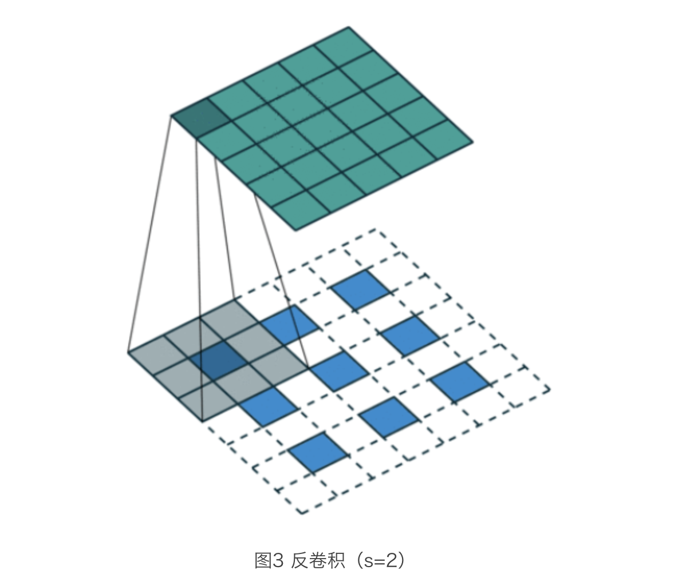
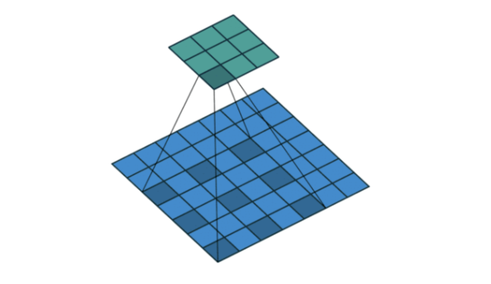
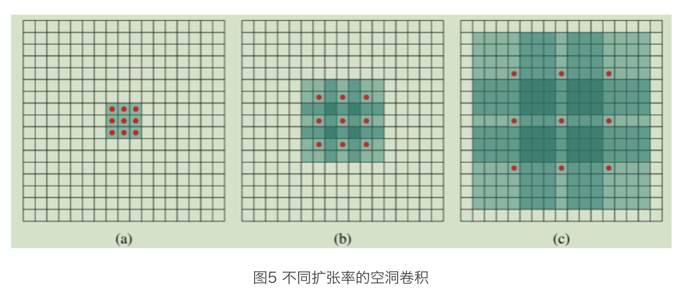
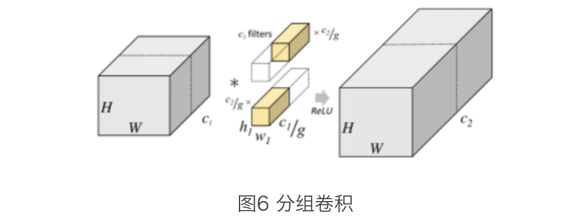

反卷积（Deconvolution）

反卷积，又命名为转置卷积（Transposed Convolutions）、小数步长卷积（Fractional Strided Convolution）、后向卷积（Back Convolutions），并且被成功运用在神经网络可视化、场景分割、生成模型等任务中。





```python
caffe:
layer {
    name: " Deconv"
    type: "Deconvolution"
    bottom: "score59"
    top: "upscore2"
    param {
    lr_mult: 1
    decay_mult: 1
    }
    convolution_param {
    num_output: 60
    bias_term: false
    kernel_size: 4
    stride: 2
    }
    }
```

```python
deconv=tf.nn.conv2d_transpose(input,weights,output_shape=output_shape, strides=[1, 2, 2, 1], padding='SAME')
```

目前反卷积有很多不同的应用场景，比如：

- 在目标分割任务中，需要对像素级特征进行回归，需要对 Feature Map 进行上采样，一般会配合反卷积使用，比如 FCN 网络；
- 在目标检测任务中，经常或采用反卷积操作来提取更丰富的特征，例如 FPN 网络；
- 在一些生成模型中，同样也会用到反卷积来上采样，例如 GAN 网络。

### 空洞卷积

空洞卷积（Dilated Convolutions，也被称为扩张卷积或者膨胀卷积。它提出的目的主要是为了解决采用 pooling 操作降低图像尺寸，增加感受野而带来信息损失的问题。以图像分割预测为例，由于其为 `pixel-wise` 的输出，所以要将 pooling 后较小的图像尺寸 upsampling 到原始的图像尺寸进行预测（通过反卷积），而 FCN 网络在先减小再增大尺寸的过程中，肯定有一些信息损失掉了，这对于最终的预测可能会产生一定程度的影响。

空洞卷积的好处是不做 pooling 损失信息的情况下，加大了感受野，让每个卷积输出都包含较大范围的信息。在图像需要全局信息或者语音文本需要较长的 Sequence 信息依赖的问题中，都能很好地应用空洞卷积，比如图像分割、语音合成 WaveNet、机器翻译 ByteNet 中，这里我们看一下空洞卷积的基本运算过程：

对比标准卷积和反卷积，不难发现，空洞卷积主要对卷积核进行的填充。一个扩张率为2的3×3卷积核，感受野与5×5的卷积核相同，而且仅需要9个参数。



上图（a）就是一个常规的 `3*3` 卷积，也是1倍扩张的空洞卷积，每个位置的感受野是 3×3；图（b）对 `3*3` 卷积，进行2倍扩张的空洞卷积，每个位置的感受野是 7×7；图（c）对 `3*3` 卷积，进行4倍扩张的空洞卷积，每个位置的感受野是 15×15。


**在实际工程中，使用空洞卷积需要注意以下几点：**

- 空洞卷积不同扩张率叠加使用时，扩张率公约数不能大于1，比如：[2,4,6] 的三层卷积，会导致有些像素点被忽视；
- 空洞卷积扩张率最好为锯齿结构，比如 [1, 2, 5, 1, 2, 5] 循环结构；
- 空洞卷积最好满足如下形式： Mi=max[Mi+1−2ri,Mi+1−2(Mi+1−ri),ri]  其中  ri表示第 i 层的扩张率；Mi 表示第 i 层的最大扩张率。
- 如果存在洞，可以采用扩张率为1的卷积，进行全覆盖。


```python
caffe:
layer {
    name: "conv"
    type: "Convolution"
    bottom: "conv_in"
    top: " conv_out"
    convolution_param {
    num_output: 512
    kernel_size: 3
    dilation: 2
    }
}
```


```python
tensorflow:stride=1
tf.nn.atrous_conv2d(value,filters,rate,padding,name=None）
```

其中：

- value：表示需要做卷积的输入图像，要求是一个4维 Tensor，分别为 [batch, height, width, channels]；
- filters：相当于 CNN 中的卷积核，要求是一个4维 Tensor，分别为 [filter*height, filter*width, channels, out_channels]；
- rate：要求是一个 int 型的正数，正常的卷积操作应该会有 stride（即卷积核的滑动步长），**但是空洞卷积是没有 stride 参数的**，这一点尤其要注意。取而代之，它使用了新的 rate 参数，定义扩张率；
- padding：取值 SAME 或 VALID。


### 分组卷积

分组卷积（Group Convolution），最早在 AlexNet 中出现，由于当时的硬件资源有限，训练 AlexNet 时卷积操作不能全部放在同一个 GPU 处理，因此作者把 Feature Maps 分给多个 GPU 分别进行处理，最后把多个 GPU 的结果进行融合。而目前，分组卷积的使用主要存在两个目的：

1. 减少网络参数；
2. 抽取通道相关的局部信息。



从上图可以看出，首先对输入的 Feature Map 进行了分组，然后对卷积核同样进行分组，然后并行运算不同分组上的卷积。每个过程里（每组），输入数据为 H1×W1×C1/g，卷积核大小为 h1×w1×C1/g，一共有 C2/g 个，输出数据为 H2×W2×C2/g，其中 g 为分组数。此时，参数个数也就变成了 h1×w1×C2/g，为原先的 1/g。


深度可分离卷积将标准卷积分成两部分，即：深度卷积（Depth Wise Convolution）和点卷积（Point Wise Convolution）两部分


### 可变形卷积

在分类任务中，通常会利用数据增强的方法来使网络“记住”这些变化，例如尺度变化、姿态变化、视角变化、局部遮挡等。既然图像能够存在多种可能，那为什么卷积核不能够有多种变化呢？比如发生旋转或者无规则变化等