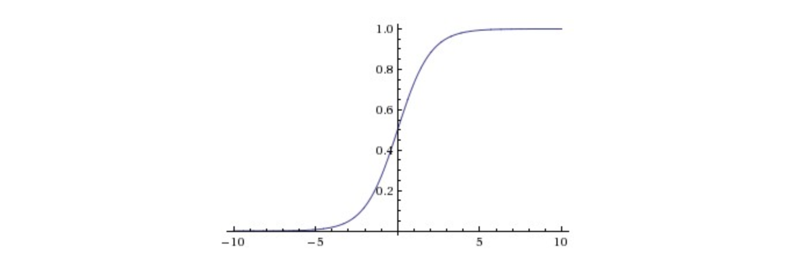
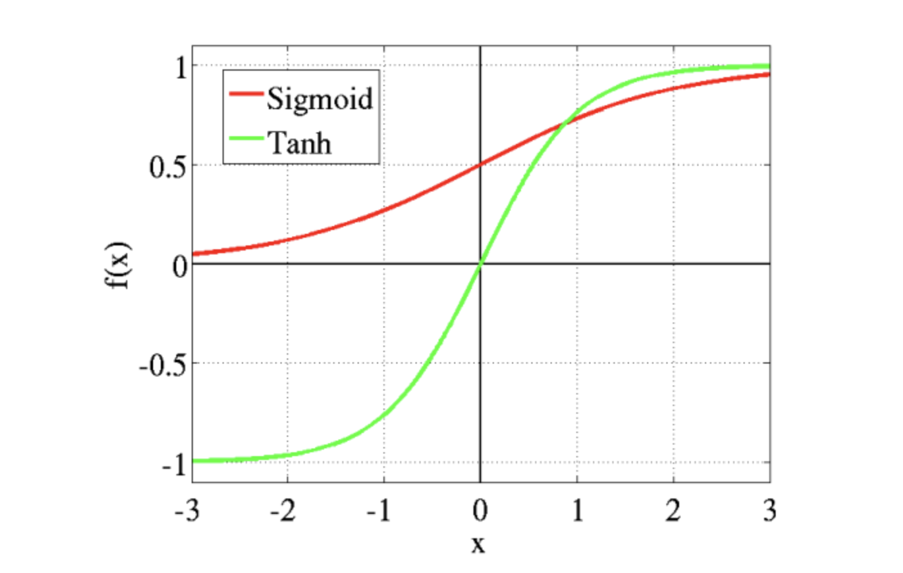
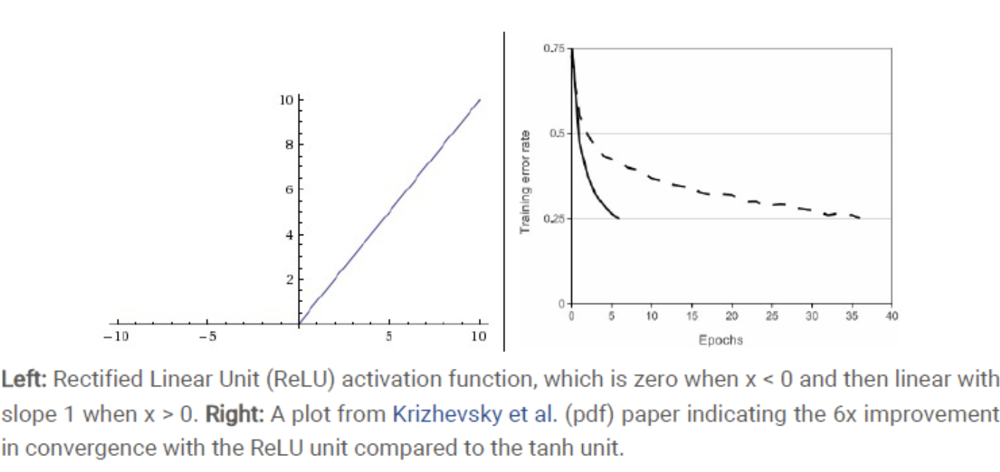
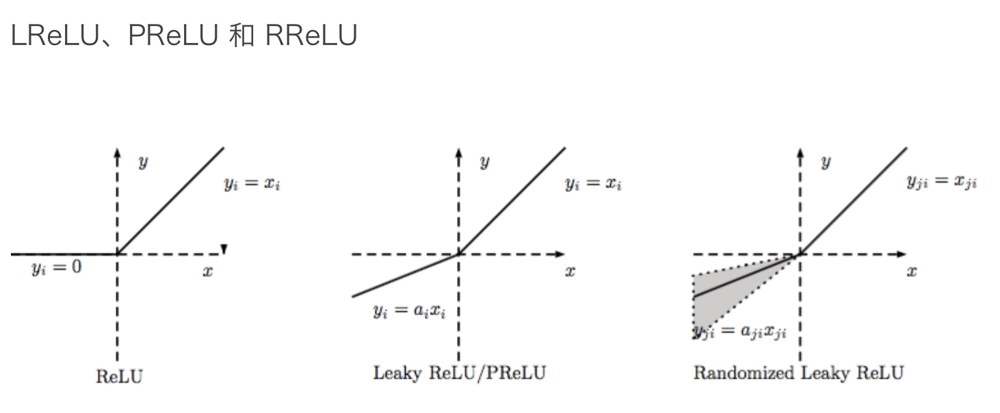
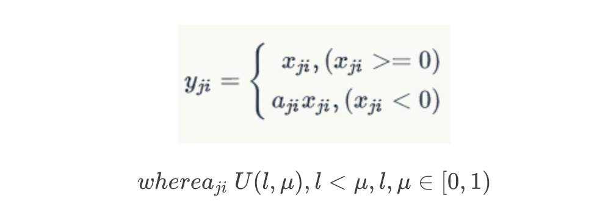
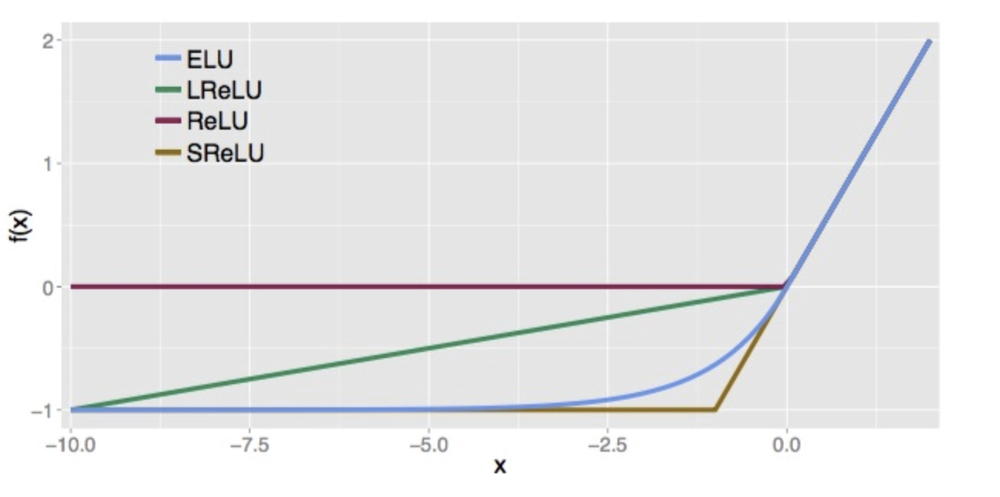

激活函数一直是深度学习中重要的组成部分，它的种类也十分丰富，常见的激活函数包括了：Sigmoid 函数、Tanh 函数、ReLU 函数、Leakly ReLU 函数、ELU 函数等等。激活函数的引入，一方面 能够加大网络的非线性拟合能力，同时也可能会导致网络训练的不收敛


激活函数的使用并不是为了激活什么，而是为了增加网络的非线性，进而提升网络的表达能力。实际上，在神经网络中（仅包括卷积和全连接），每一层输出的都是上一层输入的线性函数，如果不引入激活函数，那无论网络结构怎么搭建，输出都是输入的线性组合。这明显对于复杂的函数是没办法进行拟合逼近的


**使用激活函数的具体原因可以概括为以下几点：**

- **非线性：** 当激活函数是线性的时候，一个两层的神经网络基本上就可以逼近所有的函数了。但是，如果激活函数是恒等激活函数的时候，就不满足这个性质了，而且如果 MLP 使用的是恒等激活函数，那么其实整个网络跟单层神经网络是等价的。
- **可微性：** 当优化方法是基于梯度的时候，这个性质是必须的。
- **单调性：** 当激活函数是单调的时候，单层网络能够保证是凸函数。当激活函数满足这个性质的时候，如果参数的初始化是 Random 的很小的值，那么神经网络的训练将会很高效；如果不满足这个性质，那么就需要很用心的去设置初始值。
- **输出值的范围：** 当激活函数输出值是有限的时候，基于梯度的优化方法会更加稳定，因为特征的表示受有限权值的影响更显著；当激活函数的输出是无限的时候，模型的训练会更加高效，不过在这种情况下，一般需要更小的 Learning Rate。


### 不同激活函数对比

主要对比以下几种激活函数，具体包括：**Sigmoid**、**Tanh**、**ReLU**、**ELU**、**Maxout**、**Softplus**、**Softsign**。

Logistic Sigmoid（或者按通常的叫法，Sigmoid）激活函数给神经网络引进了概率的概念。它的导数是非零的，并且很容易计算（是其初始输出的函数） 

Sigmoid 函数被定义为：$$f(x) = \frac {1}{1+e^{-x}}$$



从函数曲线可以看出，Sigmoid 不被用于激活函数的几点原因有：

1. 在输入稍微远离坐标原点时，函数的梯度就变得很小，几乎为0。在神经网络反向传播的过程中，我们都是通过微分的链式法则来计算各个权重 w 的微分的。当反向传播经过了 Sigmod 函数，这个链条上的微分就很小很小了，如果经过多个 Sigmoid 函数，就会导致权重 w 对损失函数几乎没影响，不利于权重的优化，这个问题叫做梯度饱和，也可以叫梯度弥散。
2. 函数输出不是以0为中心的，这样会使权重更新效率降低。对于这个缺陷，在斯坦福的课程里面有详细的解释。
3. Sigmod 函数要进行指数运算，这个对于计算机来说是比较慢的。

在 Caffe 中，Sigmoid 层定义如下：

```python
        layer {
            name: "encode1neuron"
            bottom: "encode1"
            top: "encode1neuron"
            type: "Sigmoid"
        }
```

在 TensorFlow 中，定义 Sigmoid 层，采用：

```python
    tf.sigmoid(input)
```

配合使用的损失函数，如下：

```python
    tf.sigmoid_cross_entropy_with_logits(logits,labels)
```

当然，对于 Sigmoid 输出同样可以使用 `L1-loss` 或者 `L2-loss`。

#### Tanh

双曲正切函数（Tanh）是完全可微分的，反对称，对称中心在原点。为了解决学习缓慢和/或梯度消失问题，它可以使用这个函数的更加平缓的变体（Log-log、Softsign、Symmetrical Sigmoid 等等）。函数形式定义如下：



与 Sigmoid 不同的是，Tanh 是0均值的。因此，实际应用中，Tanh 会比 Sigmoid 更好


#### ReLU

修正线性单元（Rectified Linear Unit，ReLU）在 AlexNet 网络中首次使用后，迅速成为神经网络中最常用的激活函数。它保留了 step 函数的生物学启发（只有输入超出阈值时神经元才激活），不过当输入为正的时候，导数不为零，从而允许基于梯度的学习（尽管在 x=0 的时候，导数是未定义的）。函数形式定义：f(x)=max(0,x)



其优点主要有：

1. ReLU 得到的 SGD 的收敛速度会比 Sigmoid/Tanh 快很多(看右图)。
2. ReLU 函数能使计算变得很快，因为无论是函数还是其导数都不包含复杂的数学运算。

而主要缺点是训练的时候很“脆弱”，很容易就“Die”了。




LReLU 就是用来解决这个 “Dying ReLU” 的问题的。与 ReLU 不同的是：

 

这里的 α是一个很小的常数。这样，即修正了数据分布，又保留了一些负轴的值，使得负轴信息不会全部丢失。


Randomized Leaky ReLU 是 leaky ReLU 的 Random 版本 （α  是 Random 的）。它首次在 Kaggle 的 NDSB 比赛中被提出。核心思想就是，在训练过程中， α 是从一个高斯分布 U(l, μ) 中随机出来的，然后再测试过程中进行修正（有点像 Dropout 的用法）。




#### ELU

指数线性单元（Exponential Linear Unit，ELU）也属于 ReLU 修正类激活函数的一员。和 PReLU 以及 RReLU 类似，为负值输入添加了一个非零输出。和其它修正类激活函数不同的是，它包括一个负指数项，从而防止静默神经元出现，导数收敛为零，从而提高学习效率。函数形式定义如下：




它的优点主要有：

1. ELU 减少了正常梯度与单位自然梯度之间的差距，从而加快了学习。
2. 在负的限制条件下能够更有鲁棒性。

**实际工程中，选择激活函数通常可以参考以下经验：**

1. 在 RNN 网络的 LSTM、Attention 机制中会考虑 Tanh、Sigmoid 函数；
2. 在卷积层中，激活函数首选 RelU，速度快，同时注意训练状态；
3. 在 ReLU 效果欠佳时，一方面考虑调整学习率，另一方面尝试 Leaky ReLU 或 Maxout 等变种；
4. 在浅层神经网络中，如不超过4层，可选择使用多种激励函数，没有太大的影响。


 26种激活函数

https://www.cnblogs.com/shixiangwan/p/7567017.html  


