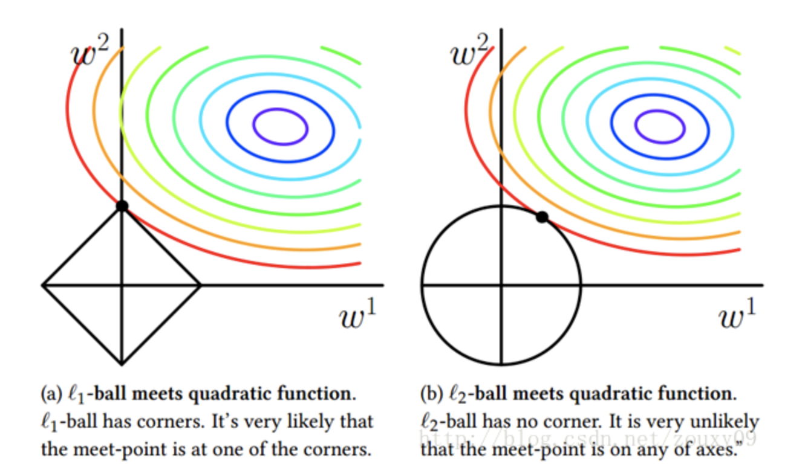
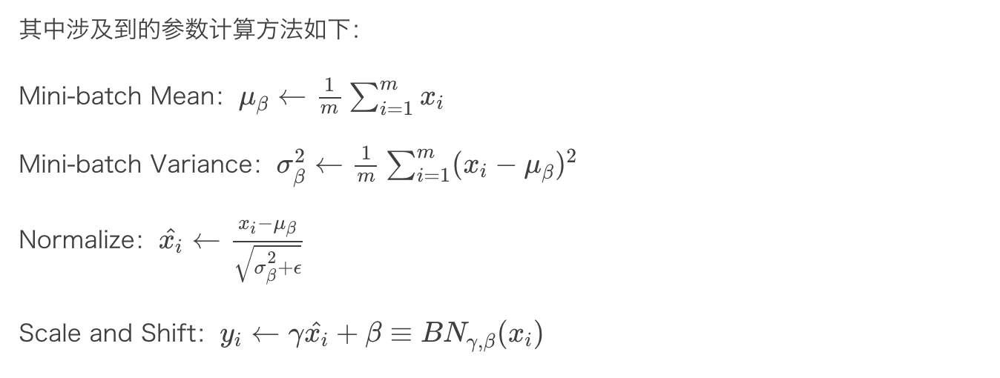

防止过拟合的常用技术：

1. 参数共享和参数绑定；
2. 参数范数约束，例如 L1、L2 范数等；
3. 训练集合扩充，例如添加噪声、数据变换等；
4. Dropout；
5. Batch Normalization；
6. 对抗训练；
7. 半监督学习；
8. 多任务学习；
9. 提前停止（Early Stopping）；
10. 集成化方法（Ensemble Methods）。


### 参数共享和参数绑定

在深度学习中，参数共享的机制通常会用于标准卷积操作中，也就是在卷积操作中，通常我们只需要学习卷积核的参数。而每一种学习到的卷积核会作用在输入的 Feature Map 上，来提取同一种特征

```python
layer {
  name: "conv2" 
  type: "Convolution"   
  bottom: "pool1"    
  top: "conv2"    
 param {
    lr_mult: 1   
  }
  param {
    lr_mult: 2    
  }
  convolution_param {
    num_output: 50  
    kernel_size: 5     
    stride: 1             
    weight_filler {       
        type: "xavier"     
    }
    bias_filler {     
      type: "constant"           
    }
  }
}
```

其中，参数 `num_output` 表示了输出 Feature Map 的通道数。实际上，更准确的说，应该是需要学习的滤波器个数，每个滤波器大小定义为 `kearnel_size` 的值。这里的滤波器就对应到了一个局部区域的感知。利用每一种卷积核对图像进行滤波处理后，能够提取到一种特征。对于每个局部区域，共享一组卷积核权值。


### 参数范数约束

在正则化方法中，范数约束是常见约束的一种，也是机器学习优化模型中最常用的方法之一，主要原因就在于：范数约束存在天然方便求导的优势。如下图所示：



其中：

- L0：参数中非零元素的个数
- L1：参数绝对值求和
- L2：参数平方和求解


推荐博客：https://blog.csdn.net/zouxy09/article/details/24971995


在深度学习中，由于模型的训练在很大程度上依赖于样本的质量。样本规模的增大，同样能够有效的防止过拟合现象的出现。理论上，当样本趋向无穷大的时候，就不再存在过拟合的问题。数据集合扩充是一个省时有效的方法，但是在不同领域方法却不太通用。

1. 对于图像数据，进行数据集扩充的方法通常包括：图片裁剪、旋转、放缩、亮度、对比度、噪声等等方法；
2. 语音识别中对输入数据添加随机噪声；
3. NLP 中常用思路是进行近义词替换；
4. 噪声注入，可以对输入添加噪声，也可以对隐藏层或者输出层添加噪声。例如，对于 Softmax 分类问题可以通过 Label Smoothing 技术添加噪声，对于类目0-1添加噪声，则对应概率变成 ϵk 和 $$1−\frac{k−1}{k}ϵ $$


### Dropout

Dropout 是一类通用并且计算简洁的正则化方法，2014年提出后被广泛的使用。

简单的说，Dropout 在训练过程中，随机的丢弃一部分输入，此时丢弃部分对应的参数不会更新。相当于 Dropout 是一个集成方法，将所有子网络结果进行合并，通过随机丢弃输入可以得到各种子网络。 

### Batch Normalization

在深度网络中，上一层的输入在经过层内运算之后得到的输出结果，很难保证分布的一致性，而伴随着网络的加深，这种分布不一致性会得到累积放大，模型的训练难度也会提高。解决这一问题的思路之一就是根据训练样本与目标样本的比例对训练样本进行一个矫正，而 BN 算法（批标准化）则可以用来规范化某些层或者所有层的输入，从而固定每层输入信号的均值与方差，也就是标准化（Batch Normalization ），简称 BN 算法。尤其在神经网络收敛过慢或者梯度爆炸无法训练的情况下都可以尝试 BN 算法。



### 对抗训练

​	对抗训练主要是为了寻找对抗样本，也就是在对已知分类正确的样本 x 进行细微变化之后得到的新的样本，新的样本在进行分类时，分类错误。因此，对于此类样本单独拿出来对分类器进行继续训练，会取得更好的效果，提升分类器的鲁棒性。当然实际上，对抗样本的搜集相对数据增强来说会存在一些难度 


### 半监督学习

半监督是一种有监督和无监督相结合的模型。在机器学习中，如何让学习过程不依赖外界的咨询交互，自动利用未标记样本所包含的分布信息的方法便是半监督学习（Semi-supervised Learning），即训练集同时包含有标记样本数据和未标记样本数据。常见的半监督算法主要包括：

1. `Self-training`（自训练算法）
2. Generative Models 生成模型
3. SVMs 半监督支持向量机
4. `Graph-Based Methods` 图论方法
5. Multiview Learing 多视角算法
6. 其他方法

实际上，对抗训练同样可以完成半监督学习的过程。半监督学习通过利用无标签样本，能够在一定程度上扩充样本量，提升深度网络的泛化能力


### 多任务学习

多任务学习通过多个任务之间的样本采样来达到减少泛化误差的目的。

多任务学习可以将多个相关任务同时学习，并且共享某些参数。多任务可以包括有监督和无监督学习。

**对于深度学习而言，可以共享底层隐藏层自然支持多任务学习。**


### 提前停止（Early Stopping）

在模型训练过程中，经常出现这种情况：随着不断迭代，训练误差不断减少，但是验证误差减少后又开始增长。

提前停止（Early Stopping）的策略是：在验证误差不再提升后，提前结束训练，而不是一直等待验证误差到最小值。

1. 提前停止策略使用起来非常方便，不需要改变原有损失函数，简单而且执行效率高。
2. 但是它需要一个额外的空间来备份一份参数。
3. 提前停止策略可以和其他正则化策略一起使用。
4. 提前停止策略确定训练迭代次数后，有两种策略可以充分利用训练数据，一是将全量训练数据一起训练一定迭代次数；二是迭代训练流程直到训练误差小于提前停止策略的验证误差。
5. 对于二次优化目标和线性模型，提前停止策略相当于 L2 正则化。


### 集成化方法（Ensemble Methods）

1. Boosting 方法：包括 Adaboosting，提升树（代表是 GBDT）、 XGBoost 等。
2. Bagging 方法：典型的是随机森林。
3. Stacking 算法。


在实际中，我们通常会使用的方法主要有：

1. 参数共享和参数绑定；
2. 参数范数约束，例如 L1、L2 范数等；
3. 训练集合扩充，例如添加噪声、数据变换等；
4. Dropout；
5. Batch Normalization；
6. 多任务网络。