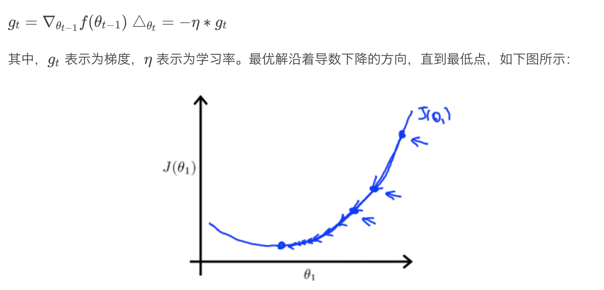
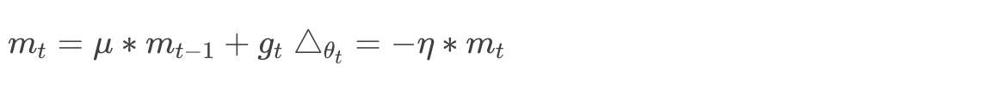
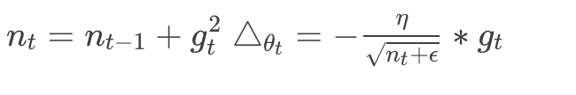
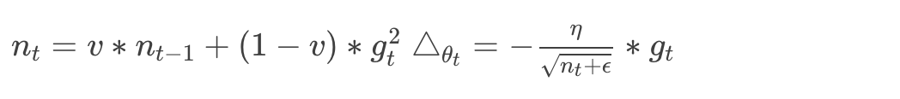
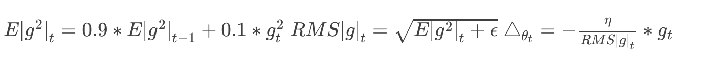
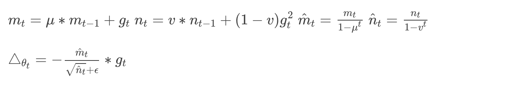

反向传播算法的有效工作是深度学习技术得以快速发展的重要基础，日常使用各种深度学习框架训练网络模型时，我们也会用到各种各样不同的优化方法，比如 SGD、Momentum、Nesterov Momentum、AdaGrad、Adadelta、RMSProp、Adam 等等


### MBGD（随机梯度下降）

在机器学习中，梯度下降的方式主要有三种：Batch Gradient Descent、Stochastic Gradient Descent，以及 Mini-batch Gradient Descent。

Batch Gradient Descent（BGD，批梯度下降）是梯度下降法最原始的形式，具体思路是每一次更新参数时都使用所有的样本进行更新。因为考虑到了全部样本，所以往往会更容易获得全局最优解，且容易实现并行化。缺点则是，当样本数目很多时，训练过程会很慢。

Stochastic Gradient Descent（SGD，随机梯度下降）改变了参数更新策略，具体思路是每次使用一个样本来更新参数。对比 BGD 算法，如果一次迭代十几万训练样本，且一次迭代不能保证 SGD 算法收敛，也就是算法收敛需要计算 m×n 次，其中 m 为样本数，n 为迭代次数。而 SGD 算法每次迭代仅需要计算1次，也就是算法收敛需要计算 n 次（n 为迭代次数）。实际上，在样本量，也就是 m 很大的情况下，可能无需样本全部跑完，就已经找到了最优解。虽然 SGD 速度比 BGD 快，但由于采用随机迭代的策略，很难保证全局最优解，准确度也会有所下降，且不易实现并行化。从迭代的次数上来看，SGD 迭代的次数较多，在解空间的搜索过程看起来很盲目。

Mini-batch Gradient Descent（MBGD）则是对 BGD 和 SGD 的平衡，具体思路是在更新每一参数时都使用一部分样本来进行更新。它能够降低 SGD 中的高方差问题，让收敛变得更加稳定，相比于 BGD，收敛速度也加快了很多。一般，`batch_size` 介于50～256之间。



在 TensorFlow 中，采用 MBGD 优化方法调用方式为：

```python
    tf.train.GradientDescentOptimizer
```

扩展定义如下：

```python
    tf.train.ProximalGradientDescentOptimizer
```

常见的写法如下：

```python
    tf.train.GradientDescentOptimizer(learning_rate).minimize(loss)
```

或者：

```python
    gradients = tf.gradients(loss, var_list)  #计算导数
    gradients = list(zip(gradients, var_list))
    optimizer = tf.train.GradientDescentOptimizer(learning_rate)
    train_op = optimizer.apply_gradients(grads_and_vars=gradients)
```

或者：

```python
    optimizer = tf.train.GradientDescentOptimizer(learning_rate)
    gradients = optimizer.compute_gradients(loss, var_list) #计算梯度
    capped_gradients = [(tf.clip_by_value(grad, -5., 5.), var) for grad, var in gradients if grad is not None]  #梯度截断
    train_op = optimizer.apply_gradients(capped_gradients)
```

在 Caffe 中，定义优化方法需要在 solver 中完成，具体定义如下：

```python
    base_lr: 0.01   
    lr_policy: "step" 
    gamma: 0.1  
    stepsize: 100000 
    max_iter: 350000  # train for 350K iterations total
    type:SGD
```

使用 MBGD 方法进行优化时，对 batch 的梯度依赖程度较高，学习率难调，且所有参数使用同一个学习率，另外，MBGD 很容易收敛到局部最优。


### Momentum

Momentum 是模拟物理里动量的概念，积累之前的动量来替代真正的梯度。公式如下：



其中，μμ 是动量因子。

它表示要在多大程度上保留原来的更新方向，这个值在0-1之间。训练开始时，由于梯度可能会很大，所以初始值一般选为0.5；当梯度不那么大时，再改为0.9。

总结来看，**Momentum 项能够在相关方向加速 SGD，抑制振荡，从而加快收敛。**

在 TensorFlow 中，采用 Momentum 优化方法调用方式为：

```python
tf.train.MomentumOptimizer
```

参数为：

- `learning_rate`：（学习率）张量或者浮点数；
- momentum： （动量）张量或者浮点数；
- `use_locking`=False：为 True 时锁定更新；
- name='Momentum'：梯度下降名称；
- `use_nesterov`=False：为 True 时，使用 Nesterov Momentum。

Momentum 具体写法可参考上述 SGD 优化方法调用。通常 Momentum 取值在0.9左右。

在 Caffe 中，定义 Momentum 需要在 slover 中特别定义：

```python
momentum: 0.9
```


### Nesterov Momentum

Nesterov 是对 Momentum 项的优化，它先大概预测下一步要下降到的位置，再做出修正——在梯度更新时做一个校正，避免前进太快，同时提高灵敏度。

### Adagrad

Adagrad 对学习率添加了一个约束，即通过添加之前所有的梯度平方的累积和作为约束项。



其中， nt 相当于对 gt 添加了一个从1到 t 递推的约束项。

**其优点有：**

1. 前期  gt 较小的时候，regularizer 较大，能够放大梯度；
2. 后期 gt  较大的时候，regularizer 较小，能够约束梯度；
3. 适合处理稀疏梯度；
4. Adagrad 不需要精调 Learning Rate（一般设置为0.01即可）

**其缺点有：**

1. 仍依赖于人工设置一个全局学习率；
2. ηη 设置过大的话，会使 regularizer 过于敏感，对梯度的调节太大；
3. 中后期，分母上梯度平方的累加将会越来越大，使梯度趋于0，导致训练提前结束。

### Adadelta

Adadelta 是对 Adagrad 的扩展，同样是针对学习率进行优化，只是在计算上进行了简化。它只累积固定大小的项，且不直接存储这些项，仅仅是近似计算对应的平均值。具体优化形式定义如下：



为了消除对全局学习率的依赖，作者通过近似牛顿迭代法对它做了进一步的优化。

它的特点有：

1. 训练初中期，加速效果不错，很快；
2. 训练后期，反复在局部最小值附近抖动。

### RMSprop

RMSprop 由 Geoff Hinton 提出，是一种自使用学习率的方法。不同于 Adagrad，RMSprop 仅仅是计算对应的平均值，可缓解 Adagrad 算法学习率下降较快的问题。RMSprop 可以算作 Adadelta 的一个特例，具体定义如下：



它的特点有：

1. RMSprop 依然依赖于全局学习率；
2. RMSprop 算是 Adagrad 的一种发展，Adadelta 的一种变体，效果趋于二者之间；
3. 适合处理非平稳目标，比如对 RNN 的效果较好。

### Adam

Adam（Adaptive Moment Estimation）本质上是带有动量项的 RMSprop，它利用梯度的一阶矩估计和二阶矩估计动态调整每个参数的学习率。Adam 的优点主要在于经过偏置校正后，每一次迭代学习率都有个确定范围，使得参数比较平稳。公式如下：



其中，mtmt，ntnt 分别是对梯度的一阶矩估计和二阶矩估计。可以看出，直接对梯度的矩估计对内存没有额外的要求，且可以根据梯度进行动态调整，而公式对学习率形成一个动态约束，且有明确的范围。

它的特点有：

1. 结合了 Adagrad 善于处理稀疏梯度和 RMSprop 善于处理非平稳目标的优点；
2. 对内存需求较小；
3. 为不同的参数计算不同的自适应学习率；
4. 适用于大多非凸优化；
5. 适用于大数据集和高维空间。


### 优化器的选择

工程中，如何选择合适的优化器，可遵循以下原则。

- 处理稀疏数据时，通常考虑学习率自适应的优化方法；
- SGD 训练虽然时间长，但结果相对更可靠；
- 如果在意更快的收敛，并且需要训练较深较复杂的网络时，可以使用学习率自适应的优化方法；
- Adadelta、RMSprop、Adam 性能相似，我更偏向于 Adam 和 RMSprop；
- 在实际工程中，可以多次使用不同的优化方法进行 fine-tuning。

```python
learning_rate = 0.1  # 学习速率
    decay_rate = 0.96  # 衰减速率，即每一次学习都衰减为原来的0.96
    global_steps = 1000  # 总学习次数
    # 如果staircase为True,那么每decay_steps改变一次learning_rate，
    # 改变为learning_rate*(decay_rate**decay_steps)
    # 如果为False则，每一步都改变，为learning_rate*decay_rate
    decay_steps = 100  

    global_ = tf.placeholder(dtype=tf.int32)
    # 如果staircase=True，那么每decay_steps更新一次decay_rate，如果是False那么每一步都更新一次decay_rate。
    learning_rate = tf.train.exponential_decay(learning_rate, global_, decay_steps, decay_rate, staircase=True)
    #调用优化器
    tf.train.GradientDescentOptimizer(learning_rate).minimize(loss)
```

