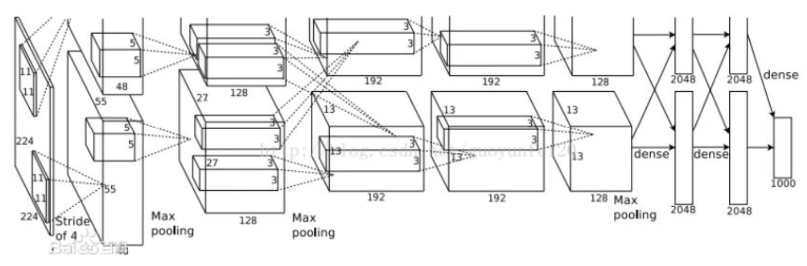

上图所示是 Caffe 中 AlexNet 的网络结构，由于受限于当时的计算资源，AlexNet 采用两台 GPU 服务器进行训练，也就存在两个流程。相比于 LeNet，AlexNet 模型的深度得到加深，而这也主要依赖于：

- 非线性激活函数：ReLU；
- 防止过拟合的方法：Dropout，Data Augmentation；
- 大数据训练：百万级 ImageNet 图像数据；
- 其他：GPU 实现，LRN 归一化层的使用。

 VGGNet 设计的初衷，**就是为了探索卷积网络深度对模型精确度有何影响**。

VGGNet 的网络结构由牛津大学的视觉几何组（Visual Geometry Group）提出，它只采用小卷积核也就是3x3的卷积模版（stride：1，padding:1）且每个卷积之后都会加一个 ReLU 激活层，并用到了5个2x2的池化层（stride：2），将卷积层的深度提升到了16-19层，并在当年 ImageNet 挑战中在定位和分类问题上取得了第一第二的好成绩，具体网络结构如下图所示：

主要优势就在于：保证感受野的同时，减少参数量和计算量，并通过添加更多的激活函数，增加非线性的判别能力，具体解释如下：

1. 两个连续的 `3*3` 的卷积相当于 `5*5` 的感受野，三个相当于`7*7`。
2. 使用 `3*3` 的3个卷积层需要`3（3×3×C×C）=27×C×C`，使用 `7*7` 的1个卷积层需要 `7×7×C×C=49×C×C`。
3. 1*1卷积层主要是为了增加决策函数的非线性（ReLU），而不影响卷积层的感受野。

**缺点**

然而，VGGNet 网络深度仅仅达到16-19层，依然距离“深”的概念还有一些差距，而网络加深带来最大的问题就是梯度弥散或爆炸，导致网络难以收敛。

ResNet 网络得以加深的主要原因，可以归结为以下几点：

1. 中间层的标准化：Batch Normalization，通过降低深层网络对浅层网络的依赖程度，尽可能保证每一层单独训练，进而使得反向传递的随机梯度下降算法开始收敛。同时，BN 层的引入，将网络参数归一化到均值为0方差为1的同分布，也确保了参数变化时，分布的一致性。另外，BN 层也相当于对参数引入噪声，实现弱正则化。
2. Short Cut：跳连结构能够实现网络差分的放大器效果，从一定程度上，减少梯度消失的问题

**Inception 系列结构的突出贡献可以总结为以下几点：**

- 利用1×1的卷积来完成通道的升和降；
- 利用 1×n 和 n×1 卷积来对标准卷积 n×n 结构进行分解；
- 增加1×1、3×3、5×5等不同尺度的感受野；
- 加深了网络的宽度；
- 与同残差网络进行结合。

### 工程实战中，如何平衡网络的深度与网络的宽度？

模型的容量意味着模型的表达能力有多强。而增加模型容量的方法可以是提高网络的深度，另外就是提升模型的宽度。然而，为什么更多的深度网络依然首选深度而不是宽度呢？

实际上，模型的容量虽然理论上很大，但是这并不意味着我们一定能找到相应问题的最优解。随着网络规模的变化，局部最优解的数目，会随着宽度的增加而呈现出指数级别的暴涨，而增加网络的宽度带来的局部优增长却缓慢多了。局部最优解过多则意味着网络过拟合的风险会更大，**因此，加深换取容度比加宽换取容度，理论上更加经济，过拟风险更低。**在实际的工程中，为了节省计算量、参数规模，同样也会更偏向于深度网络。在遇到模型瓶颈时，再考虑宽度网络提高模型性能。