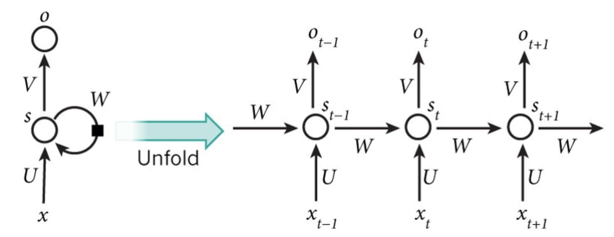
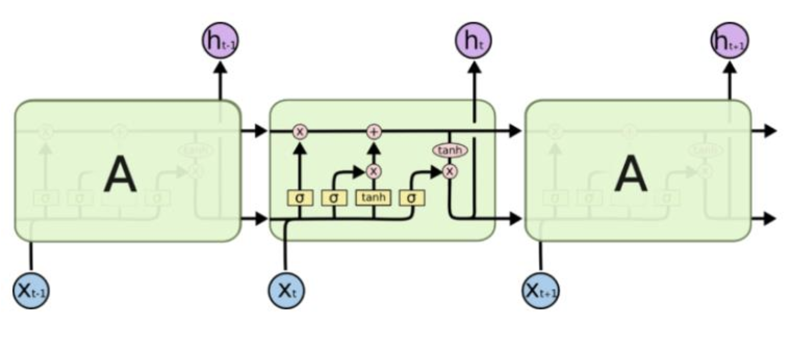
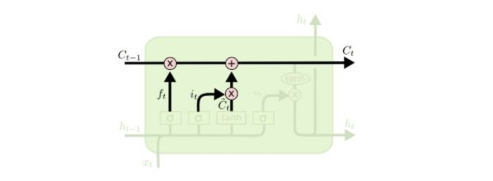
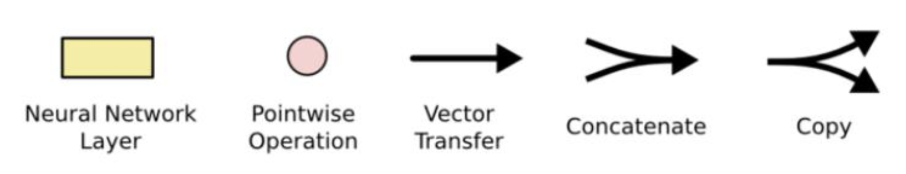

RNN 网络的基本结构单元

对于 RNN 单元，损失值与整个时间片上运算的结果相关，因此，在计算梯度的时候，同样需要考虑到整个时间片上的信息，并且需要同激活函数一起计算复合函数导数，通过梯度求导之后，就会发现梯度通常会表示为连续多个（和时间片长度相等）小于1的小数（因为 Sigmoid 和 Tanh 的导数都小于1）连乘的形式。因此，当时间片个数趋向无穷大的时候，就会很容易出现梯度消失或者梯度弥散的问题

**LSTM**:

在 LSTM 网络中，通过最上层的信息传送带，能够有效的完成历史信息的传递，而对于历史信息的筛选、优化以及同当前信息的交互，则通过三个门来实现，分别为：输入门、输出门、记忆门，对应到图中的三个 Sigmoid 函数（表示为上图的 σ）。不同于单一神经网络层，整体上除了 h 在随时间流动，细胞状态 c 也在随时间流动，细胞状态 c 就代表着长期记忆

- 黄色的矩形是通过学习得到的神经网络层；
- 粉色的圆形表示一些运算操作，诸如加法乘法；
- 黑色的单箭头表示向量的传输；
- 两个箭头合成一个表示向量的连接；
- 一个箭头分开表示向量的复制。

在上图中，最顶层的线为 Cell State，也可以理解为传送带，代表了整个模型中的记忆空间，随着时间而变化的。当然，传送带本身是无法控制哪些信息是否被记忆，起控制作用的则是控制门（Gate），而控制门的结构主要由一个 Sigmoid 函数跟点乘操作组成。Sigmoid 函数的值为0-1之间，点乘操作决定了多少信息可以传送过去，当为0时，不传送，当为1时，全部传送。三种不同控制门的作用如下：

- forget gate：选择忘记过去某些信息
- input gate：记忆现在的某些信息
- output gate：将过去与现在的记忆进行合并

**总而言之，LSTM 是对简单 RNN 模型的优化，通过门机制来控制历史信息的传输，来解决循环神经网络的长期依赖问题（将之前的连乘改变为连加的形式）。**

