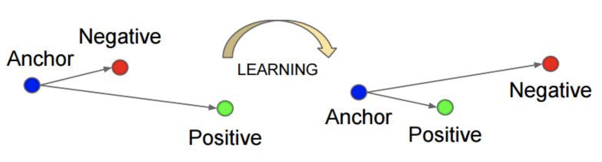

#### Siamese Net

**Siamese** 网络是一种相似性度量方法，它从数据中学习一个相似性度量，然后用该度量去比较和匹配新的未知类别的样本。通常的做法是利用一个函数将输入映射到目标空间，在目标空间使用简单的距离（欧式距离等）进行相似度对比。在训练阶段最小化来自相同类别的一对样本的损失函数值，最大化来自不同类别的一堆样本的损失函数值。主要用在降维中，即本来相似的样本，在经过降维（特征提取）后，在特征空间中，两个样本仍旧相似；而原本不相似的样本，在经过降维后，在特征空间中，两个样本仍旧不相似。

Siamese Net 主要优点可以概括为淡化了标签，使网络具有很好的扩展性，可以对那些没有训练过的类别进行分类。在这一点上，它优于很多算法，而且该算法也适用于一些小数据量的数据集，变相地增加了整个数据集的大小，使得数据量相对较小的数据集也能用深度网络训练出不错的效果。

Siamese Net 在实际的工程中，主要用于人脸验证、行人重识别等相关任务。

**SiameseNet 实现方式**

在 Caffe 中，主要采用如下方式：

```python
name: "mnist_siamese_train_test"
layer {
  name: "pair_data" # 图像是成对输入的
  type: "Data"
  top: "pair_data"
  top: "sim"  # 是一个二进制的标签，说明两幅图像是否属于同一类
  include {
    phase: TRAIN
  }
  transform_param {
    scale: 0.00390625
  }
  data_param {
    source: "examples/siamese/mnist_siamese_train_leveldb"
    batch_size: 64
  }
}
layer {
  name: "slice_pair"
  type: "Slice"
  bottom: "pair_data"
  top: "data"
  top: "data_p"
  slice_param {
    slice_dim: 1
    slice_point: 1
  }
}
layer {
  ...... conv和pooling层
}
layer {
  ......全连接层
}
layer {
  name: "feat"
  type: "InnerProduct"
  bottom: "ip2"
  top: "feat"  #第一幅图提取的特征。
  param {
    name: "feat_w"
    lr_mult: 1
  }
  param {
    name: "feat_b"
    lr_mult: 2
  }
  inner_product_param {
    num_output: 2  #特征维度为2
    weight_filler {
      type: "xavier"
    }
    bias_filler {
      type: "constant"
    }
  }
}
layer {
  ...data_p的卷积层和全连接层
}
layer {
  name: "feat_p"
  type: "InnerProduct"
  bottom: "ip2_p"
  top: "feat_p"
  param {
    name: "feat_w"
    lr_mult: 1
  }
  param {
    name: "feat_b"
    lr_mult: 2
  }
  inner_product_param {
    num_output: 2
    weight_filler {
      type: "xavier"
    }
    bias_filler {
      type: "constant"
    }
  }
}
layer {
  name: "loss"
  type: "ContrastiveLoss"
  bottom: "feat"
  bottom: "feat_p"
  bottom: "sim"
  top: "loss"
  contrastive_loss_param {
    margin: 1
  }
}
```

值得注意的是，需要分别针对于两幅图片分别进行卷积。对于两个不同分支，采用参数共享来完成相关层定义，也就是保证 param 中的 name 一致，具体参见《第05课：局部感知的妙处》。最后，采用 ContrastiveLoss 层来计算最后的 Loss，并用于反向传播。

采用 Tensorflow 可以定义 Contrastive Loss，形式如下：

```python
def compute_contrastive_loss(left_feature, right_feature, label, margin):
    """
    Compute the contrastive loss as in
    L = 0.5 * Y * D^2 + 0.5 * (Y-1) * {max(0, margin - D)}^2
    **Parameters**
     left_feature: First element of the pair
     right_feature: Second element of the pair
     label: Label of the pair (0 or 1)
     margin: Contrastive margin
    **Returns**
     Return the loss operation
    """
    label = tf.to_float(label)
    one = tf.constant(1.0)
    d = compute_euclidean_distance(left_feature, right_feature)
    d_sqrt = tf.sqrt(compute_euclidean_distance(left_feature, right_feature))
    first_part = tf.mul(one-label, d)# (Y-1)*(d)
    max_part = tf.square(tf.maximum(margin-d_sqrt, 0))
    second_part = tf.mul(label, max_part)  # (Y) * max(margin - d, 0)
    loss = 0.5 * tf.reduce_mean(first_part + second_part)
    return loss
```

#### Triplet Net

Triplet 是一个三元组，这个三元组是这样构成的：从训练数据集中随机选一个样本，该样本称为 Anchor，然后再随机选取一个和 Anchor（记为 xa ）属于同一类的样本和不同类的样本，这两个样本分别称为 Positive（记为 xp ）和 Negative（记为  xn），由此构成一个（Anchor、Positive、Negative）三元组， 如下图所示。



### 多支网络的训练技巧

在实际的工程中，使用多支网络结构，例如 SiameseNet、TripletNet 等，在训练时需要注意以下几点：

- 可以采用数据增强的方法扩充同类样本数据，以减少正负样本对不平衡给训练带来的影响；

- 使用难例挖掘的策略，对于 Triplet Loss，通常有以下定义。

  （1）Easy Triplets：可以使 `loss = 0` 的三元组，即容易分辨的三元组。

  （2）Hard Triplets：`d(a,n)<d(a,p)` 的三元组，即一定会误识别的三元组。

  （3）Semi-hard Triplets：`d(a,p)<d(a,n)<d(a,p)+margin` 的三元组，即处在模糊区域（关键区域）的三元组。

- 对于训练而言， Semi-hard Triplets 更有意义。

- 尽量采用在线的难例挖掘策略