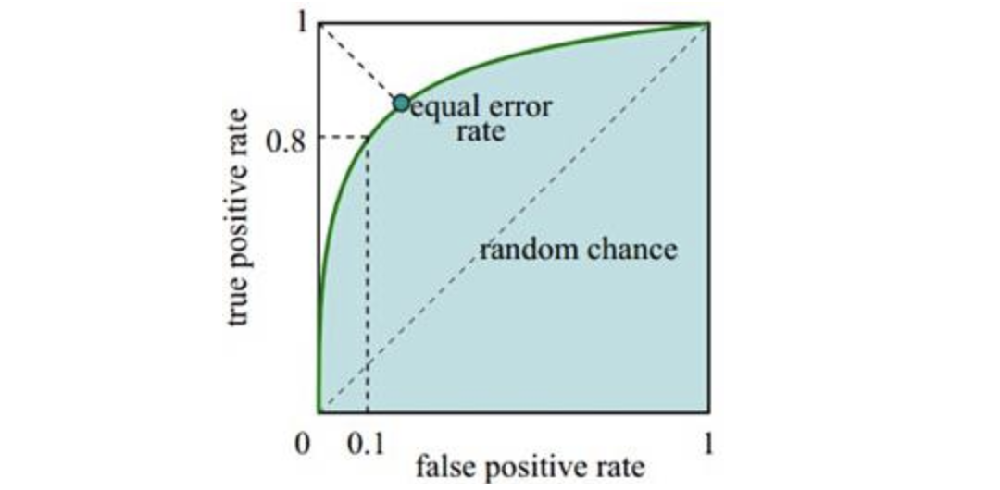
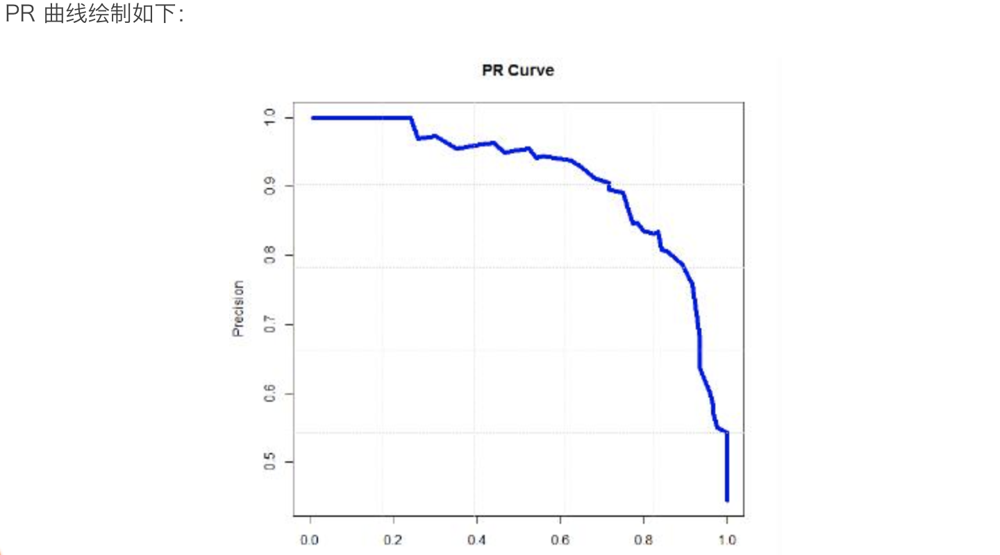
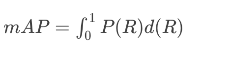
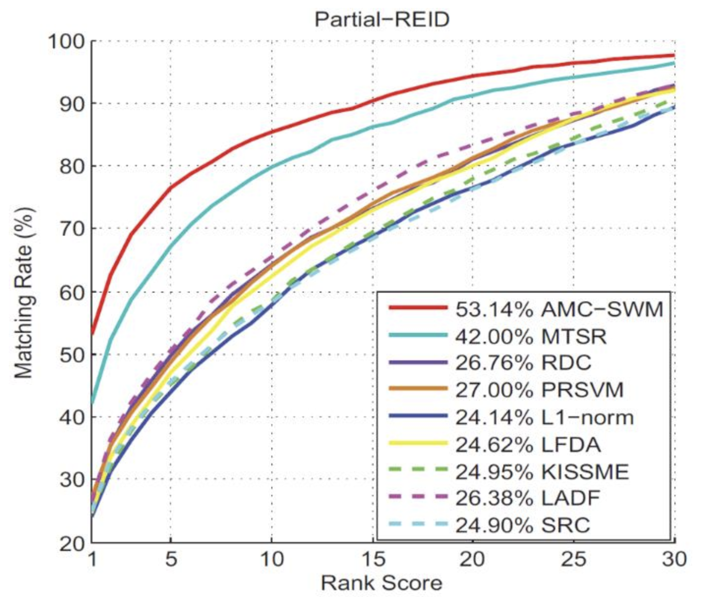
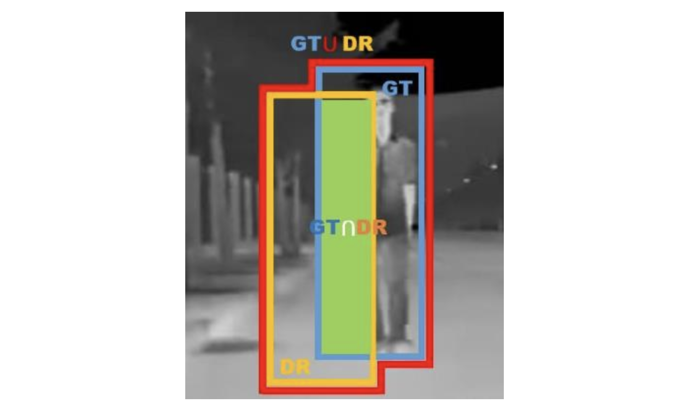
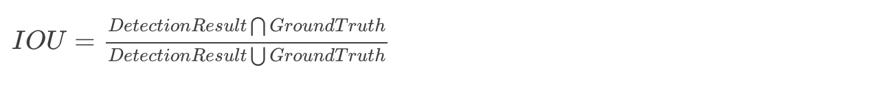
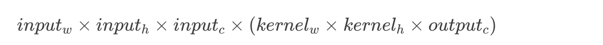
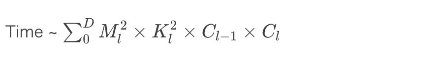

**常用的数据增强方法有以下几种。**

1. 旋转/反射变换（Rotation/Reflection）：随机旋转图像一定角度，改变图像内容的朝向；
2. 翻转变换（Flip）： 沿着水平或者垂直方向翻转图像。
3. 缩放变换（Zoom）： 按照一定的比例放大或者缩小图像；
4. 平移变换（Shift）： 在图像平面上以一定方式对图像进行平移，可以采用随机或人为定义的方式指定平移范围和平移步长，沿水平或竖直方向平移，从而改变图像内容的位置；
5. 尺度变换（Scale）：按照指定的尺度因子，对图像进行放大或缩小；
6. 对比度变换（Contrast）：针对图像 HSV 颜色空间，调整 S 通道的值来改变饱和度，调整 V 通道的值来改变亮度，调整 H 通道的值来改变色调；
7. 噪声扰动（Noise）：对图像每个像素的 RGB 随机扰动，常用的噪声模式是椒盐噪声和高斯噪声；
8. 颜色变化：在图像通道上添加随机扰动；
9. 随机添加 Blob：输入图像随机选择一块区域涂黑，参考《Random Erasing Data Augmentation》。

在实际训练模型时，数据增强的方法尽量在网络中完成。在 Tensorflow 中，常用于处理数据增强的函数包括以下几种。

**1. 随机裁剪**

随机裁剪输入的图像，得到子图区域，定义如下。

```
crop_img = tf.random_crop(img,[280,280,3])
```

**2. 裁剪填充**

裁剪填充是指对图像随机裁剪或随机填充。其中，随机裁剪可缩小图片，图片周围自动填充黑色区域可放大图像。图像最终被归一化到相同尺寸，具体定义如下：

```
resize_img = tf.image.resize_image_with_crop_or_pad(img_data, 600, 600)
```

**3. 方框剪切**

方框剪切是指从图像中，裁剪一个矩形区域，定义如下，其中的参数分别为图像数据、左上角坐标、Height 和 Width。

```
# # similar func:tf.image.pad_to_bounding_box
# 图片（0， 0）位置在左上角， （50,50）指height，width在图片左上角的偏移量
resize_img = tf.image.crop_to_bounding_box(img_data, 50, 50, 300, 300)
```

**4. 按比例缩小图片**

该函数是指按比例对图像进行裁剪，也就是缩小图片大小，具体定义如下：

```
image = tf.image.central_crop(image, 0.5)　
```

**5. 亮度**

调整图像亮度，通常有两种实现：`random_brightness` 和 `adjust_brightness`。其中，`random_brightness` 定义为随机调整亮度。

```
image = tf.image.random_brightness(image, max_delta=32. / 255.)#亮度
image = tf.image.adjust_brightness(image, delta=-.7)
```

**6. 饱和度**

调整图像饱和度，通常有两种实现：`random_saturation` 和 `adjust_saturation`。其中，`random_saturation` 定义为随机调整饱和度。

```
image = tf.image.random_saturation(image, lower=0.5, upper=1.5)#饱和度
image = tf.image.adjust_saturation(image, 5)
```

**7. 色相**

调整图像色相，通常有两种实现：`random_hue` 和 `adjust_hue`。其中，`random_hue` 定义为随机调整色相。

```
image = tf.image.random_hue(image, max_delta=0.2)#色相
image = tf.image.adjust_hue(image, 5)
```

**8. 对比度**

调整图像对比度，通常有两种实现：`random_contrast` 和 `adjust_contrast`。其中，`random_contrast` 定义为随机调整对比度。

```
image = tf.image.random_contrast(image, lower=0.5, upper=1.5)#对比度
image = tf.image.adjust_contrast(image, 5)#对比度
```

**9. 上下翻转/左右/转置翻转/90 度旋转**

图像增强可通过图像翻转来实现，常用的方法有翻转 90 度、左右翻转、上下翻转，具体定义如下：

```
image = tf.image.rot90(img_data, k=-1)
image = tf.image.random_flip_left_right(img_data)
image = tf.image.random_flip_up_down(img_data)
```

**10. Draw Boxes**

在图像中添加一些 BoundingBoxes 可进行数据增强，通常定义如下：

```
image = tf.image.draw_bounding_boxes(tf.expand_dims(image, 0), [[[0.1, 0.2, 0.5, 0.9]]])
```

**11. 对数据进行标准化**

对数据进行标准化，也可完成数据增强，通常的做法是对数据减去均值，除去方差，保证数据的分布均值为 0，方差为 1。具体采用如下函数实现：

```python
tf.image.per_image_whitening()
```


### 深度网络的评测标准

#### 模型准确度

不同的任务往往有不同的指标要求，这些指标是衡量模型是否有效的重要参考信息，主要包括模型准确度、模型参数量、模型耗时等。接下来，我们分别介绍上述概念。

首先是**模型准确度**。在机器学习任务中，学会评价一个模型的好坏，也是大家必备技能之一。与模型准确度相关的指标有：

1. 与分类任务相关的准确度指标
2. 与排序任务相关的准确度指标
3. 与检测任务相关的准确度指标

我们具体来看一下。

**1. 与分类任务相关的准确度指标**

与分类任务相关的指标通常有 ROC 曲线、AUC 指标，具体定义如下。

**（1）ROC 曲线**

在二分类问题中，需将实例分成正类（Postive）或负类（Negative）。但实际分类时，会出现四种情况。

- 若一个实例是正类并且被预测为正类，即为真正类（True Postive，TP）；
- 若一个实例是正类，但是被预测为负类，即为假负类（False Negative ，FN）；
- 若一个实例是负类，但是被预测成为正类，即为假正类（False Postive，FP）；
- 若一个实例是负类，但是被预测成为负类，即为真负类(True Negative，TN)。

其中，FN 对应了漏报的情况，也就是我们将正样本识别成了负样本的情况。而 FP 则对应了误报的情况，也就是我们将负样本识别成了正样本的情况。

据上述定义，进一步获得如下指标：

- 真正类率（True Postive Rate，TPR）：TP/(TP+FN)，代表分类器预测的正类中，实际正实例占所有正实例的比例。

- 负正类率（False Postive Rate，FPR）：FP/(FP+TN)，代表分类器预测的正类中，实际负实例占所有负实例的比例。

- 真负类率（True Negative Rate，TNR）：TN/(FP+TN)，代表分类器预测的负类中，实际负实例占所有负实例的比例，TNR=1-FPR。

  

  

  横轴代表 FPR，FPR越大，预测正类中实际负类越多。纵轴代表 TPR，TPR 越大，预测正类中实际正类越多。

  我们的理想目标是 TPR=1，FPR=0，即图中（0，1）点，故 ROC 曲线越靠拢（0，1）点，越偏离 45 度对角线越好。

  如何利用 ROC 曲线来评价模型好坏呢？通常还要借助 AUC 指标来衡量。

  **（2）AUC 指标**

  AUC（Area Under The Curve)，也就是 ROC 曲线的下夹面积，越大说明分类器越好，最大值是 1，图中的蓝色区域面积就是 ROC 曲线对应的 AUC。

**2. 与排序任务相关的准确度指标**

与排序任务相关的准确度指标通常有 PR 曲线、MAP、CMC 曲线，具体介绍如下。

**（1）PR 曲线**

以图像检索为例， 查准率 Precision 就是在识别出来的图片中，True Positives 所占的比率：

precision=$$\frac{TP}{TP+FP}​$$ 

其中，True Positives + False Positives 表示系统识别出的照片总数 。

查全率 Recall 是指被正确识别出来的目标个数与测试集中所有目标个数的比值：

recall=$$\frac{TP}{TP+FN}$$  

其中，True Positives + False Negatives，这两个值的和，可以理解为数据库中检测目标的实际数量。



**（2）MAP**

有了上述 PR 曲线后，通常根据 PR 曲线同 Recall 和 Precision 两个轴构成的面积大小，也就是 MAP，来评价一个模型的好坏：



MAP 值越大，模型性能越优。

**（3）CMC 曲线**

CMC 曲线（Cumulated Matching Characteristic Curve）是检验系统性能的参数，常用于人脸识别、行人重识别等领域。

通常采用 Rank-N 形式来定义识别率。也就是，在按照相似度量排序后，在前 N 个排序结果中，能够准确匹配到候选目标所占的比例。

举个例子，比如，我们训练了一个分类器，来识别五个物体，即 1、2、3、4、5，它们属于三类即 A、B、C。假设属于 A 类的物体 1，经过分类器，得到属于 A、B、C 类的概率分别是 80%、50%、5%，这时可将物体 1，判定为 A 类。物体 1 经过一次排序就被命中正确的类，我们表示 Rank-1 为 100%。若物体 2 本来属于 B 类，被分类器分类为 A、B、C 的概率分别为 50%、40%、30%，这时被判定为 A 类。按照概率排序，如果有两次机会，才能命中，也就是 Rank-2。

综上五个物体，如果每个都能第一次命中，所以五个物体的 Rank 分别是：

```
rank-1 100%
rank-2 100%
rank-3 100%
```

如果物体 1、2，第一次就命中，3，4 在两次才能命中，5 为第三次命中，则有：

```
rank-1 40%
rank-2 80%
rank-3 100%
```

这就是 CMC 曲线，而一次命中率越高，说明模型的性能越好。绘制出的曲线如下图所示：



注意，CMC 曲线一定是一条上升的曲线。

**3. 与检测任务相关的准确度指标**

在目标检测任务中，通常使用 IOU 判定目标是否检测正确，并利用 AP 和 MAP 来具体衡量模型整体检测的准确性。

**（1）IOU**

IOU 定义为两个区域之间的重叠面积所占的比例，如下图所示：



- 蓝色的框表示 GroundTruth；
- 黄色的框表示 DetectionResult；
- 绿色的框表示 DetectionResult ⋂ GroundTruth；
- 红色的框表示 DetectionResult ⋃ GroundTruth 。




**（2）AP**

对于单张图片中的某一类检测目标，定义 IOU>0.5 为检测正确，否则检测错误

**（3）MAP**

MAP 则是全部类别准确度的一个平均值，即：

$$mAP=\frac{∑AP}{N}$$

其中，N 为类别总数。


#### 模型的参数量

对于深度模型而言，模型参数量同样是一个需要注意的问题。通常情况下，参数量越大意味着模型的复杂度越高，存在过拟合的风险也就越大。

对于 CNN 网络，模型的参数量为各个层参数量之和。每一层的参数数量需要由该层的规模（`n_units`）和上一层的输出（`n_features`）共同决定。

**1. 全连接层**

全连接层，实际上由多个线性运算构成，每个线性运算表达了输出节点同输入神经元的连接关系。对于全连接层，具体参数量取决于输入层节点数和输出层节点数。

```
    input_shape: [batch_size, n_features]
    output_shape: [batch_size, n_units]
    参数数量 = n_features * n_units
    参数数量 = n_features * n_units + n_units （使用偏置）
```

**2. Conv1D**

对于一维卷积，参数量与卷积核大小、输入特征 Channel 数量及输出特征 Channel（滤波器）数量有关。其中，`input_shape` 定义了输入 Feature Map 的 Shape，`out_shape` 为输出 Feature Map 的 Shape。

```
    input_shape: [batch_size, max_steps, n_features]
    output_shape: [batch_size, new_steps, n_filters]
    kernel_size = [kernel_w]
    kernel_shape = [kernel_w, n_features, n_filters]

    参数数量 = kernel_w * n_features * n_filters
    参数数量 = kernel_w * n_features * n_filters + n_filters （使用偏置）
```

**3. Conv2D**

对于二维卷积，参数量同样与卷积核大小、输入特征 Channel 数量和输出特征 Channel（滤波器）数量有关。其中，`input_shape` 定义为输入 Feature Map 的 Shape，`out_shape` 为输出 Feature Map 的 Shape。

```
    input_shape: [batch_size, in_height, in_width, in_channels]
    output_shape: [batch_size, new_height, new_width, out_channels]
    kernel_size = [kernel_h, kernel_w]
    kernel_shape = [kernel_h, kernel_w, in_channels, out_channels]

    参数数量 = kernel_h * kernel_w * in_channels * out_channels
    参数数量 = kernel_h * kernel_w * in_channels * out_channels + out_channels （使用偏置）
```

**4. RNN**

对于标准的 RNN 层，实际上每个隐藏层单元主要进行线性运算，如下：

$$h(x)^t=f(Ux^t+Wh^{t−1}+b)$$

隐藏单元之间参数共享。因此，对于标准 RNN 层，参数量主要为 U、W、b。其 Shape 定义如下：

```
    U: [n_units, n_features]
    x: [n_features, 1]
    W: [n_units, n_units]
    h: [n_units, 1]
    b: [n_units, 1]

    参数数量 = (n_features + n_units) * n_units + n_units
```

#### 模型的耗时

模型的耗时通常和计算量有关。在深度学习中，模型的计算量统计的是乘加运算的次数，计量单位通常为 FLOPS。

FLOPS（Floating-point Operations Per Second）表示每秒所执行的浮点运算次数，用来衡量计算机计算能力。它经常应用于那些需要大量浮点运算的科学运算中。有时也会被记为 flop/s。

> 一个 MFLOPS（megaFLOPS）等于每秒 1 百万 (=10^6) 次的浮点运算
>
> 一个 GFLOPS（gigaFLOPS）等于每秒 10 亿 (=10^9) 次的浮点运算
>
> 一个 TFLOPS（teraFLOPS）等于每秒 1 万亿 (=10^12) 次的浮点运算
>
> 一个 PFLOPS（petaFLOPS）等于每秒 1 千万亿 (=10^15) 次的浮点运算

MACS 表示每秒执行的定点乘累加操作次数，用来衡量计算机定点处理能力，它经常用于那些需要大量定点乘法累加运算的科学运算中，记为 MACS。

> 一个 GMACS 等于每秒 10 亿 (=10^9) 次的定点乘累加运算

对于卷积层，计算量通常定义为（不考虑偏置项）：

卷积神经网整体的计算量，则主要体现在卷积层。因此，需要将全部卷积层计算量进行相加，最后得到最终网络的整体计算量，具体定义如下：



其中，D 表示全部卷积层，M 表示输入 Feature Map 大小、K 表示卷积核大小 Cl−1 表示输出层的通道数、 Cl 表示输入层的通道数。