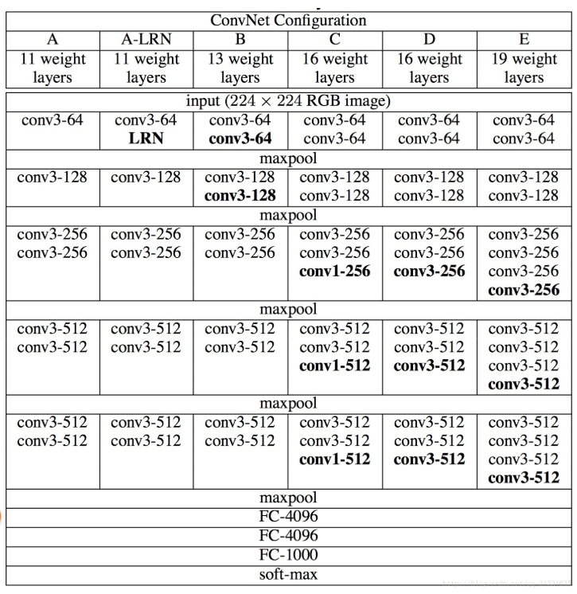
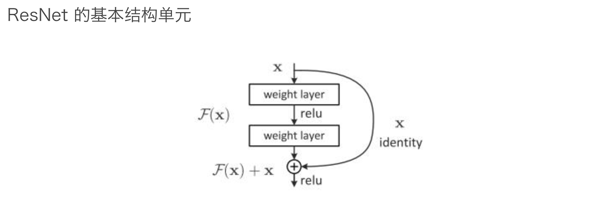
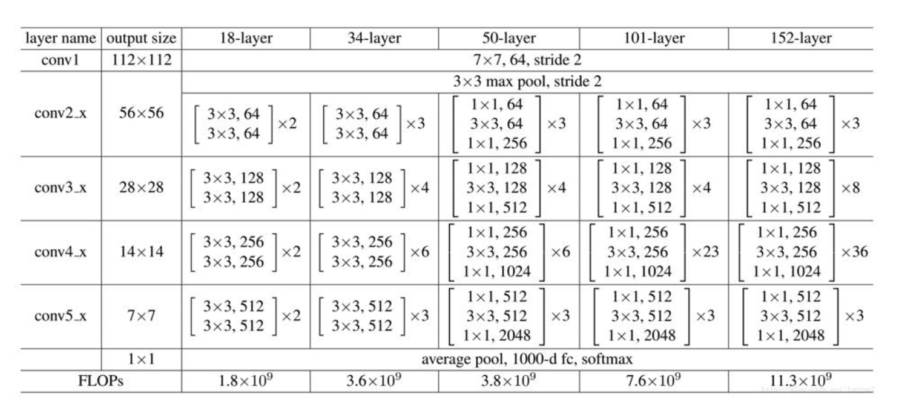
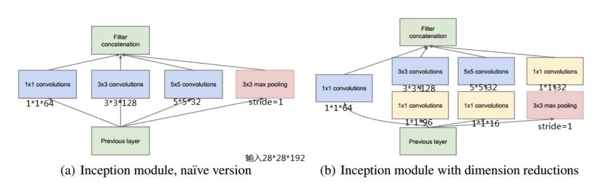
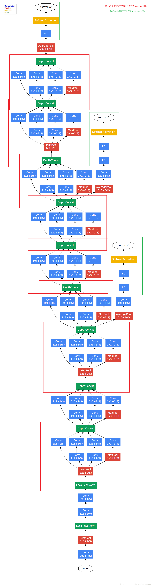

对比 LeNet5，AlexNet 主要特点总结如下：

1. 重叠最大池化，避免平均池化的模糊化效果，步长比池化核小，提取更多信息；
2. 使用了 ReLU（整流线性单元）的非线性。与 tanh 或 Sigmoid 这样的饱和激活函数相比，使用 ReLU 非线性可以使深度 CNNs 训练得更快；
3. 利用数据增强，减少过度拟合；
4. Dropout 层。对于某一层神经元，通过定义的概率来随机删除一些神经元，同时保持输入层与输出层神经元个数不变，然后按照神经网络的学习方法进行参数更新，下一次迭代中，重新随机删除一些神经元，直至训练结束；
5. 标准化（Local Response Normalization）使用 ReLU f(x)=max(0,x) 后，你会发现激活函数之后的值不像 tanh、Sigmoid 函数那样有一个值域区间，所以一般在 ReLU 之后会做一个 Normalization。

AlexNet 的性能为什么可以远超传统模型？分析原因如下：

1. 大量数据，Deep Learning 领域应该感谢李飞飞团队搞出如此大的标注数据集合 ImageNet；
2. GPU，这种高度并行的计算神器支撑了更复杂模型的训练；
3. 算法的改进，包括网络变深、数据增强、ReLU、Dropout 等。

#### VGGNet

VGGNet 由牛津大学计算机视觉组和 Google Deepmind 共同设计。设计 VGGNet 网络是为了研究网络深度对模型准确度的影响，并采用小卷积堆叠的方式，搭建整个网络结构。与之前的网络结构相比，它增加网络深度的同时，还大幅度提高了准确率，并在 2014 年 ILSVRC 挑战赛上大放异彩。

网络结构如下：

与之前网络相比，VGGNet 的核心贡献点在于：

1. 更深的网络结构，结构更加规整、简单；
2. 全部使用 3*3 的小型卷积核和 2*2 的最大池化层；
3. 每次池化后，Feature Map 宽高降低一半，通道数量增加一倍。

VGGNet 相比于之前的网络层数更多、结构更深，模型参数量更大。

可以说，VGGNet 的设计思路成为后续卷积神经网设计的基本规范之一。在后续的很多任务中，例如 检测、分割等，VGGNet 成为常用的基础网络之一。

**ResNet 的核心贡献可以总结为以下几点：**

1. 提出跳连结构（Short-Cut），解决梯度消失问题；
2. 使用 BatchNorm 层，加快网络收敛速度和训练稳定性；
3. 加大网络深度，并且提高了模型的特征抽取能力。

《[残差网络 ResNet 笔记 ](https://www.cnblogs.com/alanma/p/6877166.html)》

#### ResNet 网路结构

分析上述结构，有一些经验可以应用到后续的网络设计过程中：

1. ResNet 同样沿用了 VGGNet 设计思路，也就是核心单元简单堆叠的思想；
2. Feature Map 尺寸减少，Channel 的数量增加；
3. 使用 Average Pooling 层代替 FC 层；
4. 采用小卷积核，主要是 1\*1 和 3\*3。

#### ResNet 使用经验和技巧

在实际工程项目中，通常会优先考虑使用 ResNet 网络结构作为主干网络（基网络），在具体使用时，需要注意以下几点：

1. 在使用 ResNet 网络时，需要考虑模型的参数量，尤其在嵌入式设备中使用时，需要调整网络参数，或者适当裁剪网络；
2. ResNet 存在 Short-Cut 结构，数据流向并不是一直从上到下，跳连的部分可能会占用内部缓存，在实际工程中尤其需要注意这个问题；
3. BatchNorm 的使用能够确保 ResNet 网络的稳定和效果，一定要注意相关参数的设置，不要出现配置上的问题；
4. 堆叠的结构设计，是网络设计中常用的方法之一。

#### GoogLeNet/Inception v1

GoogLeNet 在设计网络结构时，不仅强调网络的深度，也会考虑网络的宽度，并将这种结构定义为 Inception 结构，这是一种网中网（Network In Network）的结构，即原来的结点也是一个网络。具体如下所示。

1. 对比 AlexNet 等网络，GoogLeNet 的网络结构更深。不同于 ResNet，GoogLeNet 在加大网络深度的同时，采用两个 Loss 来防止梯度消失问题；
2. 除了考虑网络深度以外，GoogLeNet 还进一步考虑了网络的宽度，通过多种卷积核 1x1、3x3、5x5，以及直接 Max Pooling 来进行多粒度特征抽取，并采用 Concat 增加网络宽度；
3. 通过 1x1 卷积核进行通道降维，减小计算量。

分析上述网络结构，其中，值得我们学习的地方主要有以下几点：

1. 采用了 Average Pooling 代替全连接层，减少参数量；
2. 为了避免梯度消失，网络额外增加了两个辅助的 Softmax，用于向前传导梯度；
3. 网络结构设计时，更多考虑到重复的模块，整体结构更加规整，实现起来更加容易。

另外，针对 Inception 结构，Google 后来又陆续提出了 Inception V2、V3、V4 等结构。

#### Inception V2/V3

Inception V2 在 Inception V1 基础上做了进一步优化。具体优化如下：

1. 同 VGGNet 思路一致，采用小卷积核堆叠代替掉大的卷积核，比如两个 3*3 可以代替一个 5*5。一方面能够增加网络的深度，提高特征的鲁棒性，另一方面能够提高网络的非线性表达能力；
2. 提出 BatchNormalization 层，一方面加快网络训练速度，另一方面对网络加入正则化约束，BN 层的引入会对每一个 Mini-batch 数据的内部进行标准化，使输出服从 N(0,1) 的正态分布，减少了内部神经元分布的改变。

在 Inception V3 中，作者进一步对 Inception V2 结构进行了优化：

1. 采用 1xn 卷积后接 nx1 卷积代替 nxn 的卷积，进一步减小网络参数量和计算量；
2. 上述分解用在前几层上，效果并不好，建议使用在 Feature Map 大小在 12~20 之间的层上

#### Inception V4

Inception V4 研究了如何将 Inception Module 同 Residual Connection 结构结合的问题。结合 Residual Connection， 可以极大地加速训练，极大提升性能。在构建 Inception-ResNet 网络的同时，作者还设计了一个更深更优化的 Inception v4 模型，能达到相媲美的性能

