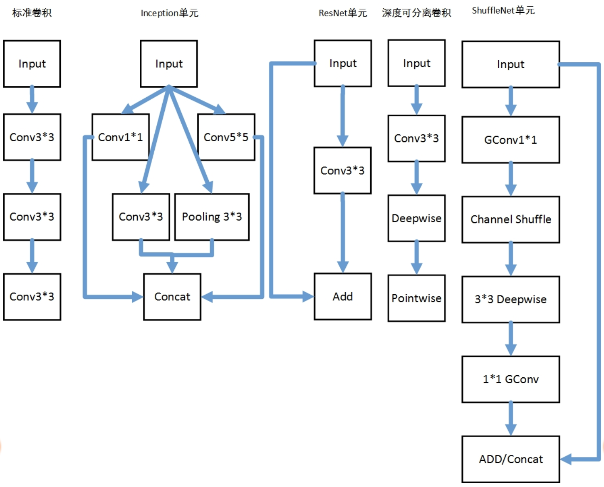

#### 不同卷积结构对比与设计经验

分析上述结构，不难发现，标准卷积的计算量要比轻量型卷积大，但性能更优。Inception 和 ResNet 这样的单元，是目前标准卷积更加高阶的应用，由标准卷积构成的这些结构，具有更好的特征抽取和表示能力。而轻量型卷积的整体网络参数规模通常要比标准卷积网络下降几十倍，计算量也会大大减少，因此在嵌入式设备或者终端设备中，通常会考虑这些网络结构。

通过上面的分析，我们可以总结出以下几条经验，在实际工作中设计卷积时可参考：

1. 设计卷积网络时，通常采用重复结构堆叠的方式，每个重复结构通常是一个基本的单元；
2. 卷积结构的拆分，对轻量型网络来说十分重要，如何利用小的卷积核对当前卷积进行拆分十分关键；
3. 合理利用 1*1 卷积可减少网络计算量，也可以通过 1*1 的卷积来改变 Channel 数量；
4. 合理利用分组卷积可以减少计算量，1*1 的卷积能够增加通道之间的信息融合，且计算量小，通常配合分组卷积使用；
5. 在 Feature Map 下采样时，通常会增加 Channel 的数量；
6. 对于 ResNet、ShuffleNet 这样存在跳连（Short-cut）的结构，在进行不同深度特征连接时，可以采用 ADD 或者 Concat 的方式，需要注意的是，要保证特征大小的一致性，可以采用 1*1 的卷积来改变 Channel 数量，或者 Pooling 进行下采样；
7. 在使用卷积时，可以使用 Padding 保证 Feature Map 在进行卷积时不损失大小，如果对 Feature Map 大小无要求，比如分类任务，则可以忽略这一条；
8. 在增加网络深度和宽度两种选择下，通常优先考虑增加网络深度；
9. 相比标准卷积，深度可分离卷积的计算量会减少，但无法保证有同样的精度，可能会有所下降；
10. 在选择基网络时，优先考虑 ResNet 这样的结构，再进一步考虑 MobileNet 这样的轻量型网络，确保性能的同时，减少模型参数量和计算量；
11. 在设计卷积网络时，一定要注意大多数的计算量会集中在最开始的几层，主要是因为 Feature Map 尺寸通常较大；
12. 对于第一个卷积，也就是针对原始图像进行卷积，可以采用较大的卷积核来增大感受野，原因在于原始图像 Channel 的数量通常为 1 或 3；
13. 网络输入图像的大小，通常可以考虑 224、160、300、320 这样的尺寸；
14. 图像通常需要减均值，并且归一化到 0~1 之间；
15. 可以考虑通过数据增强的方法来提高模型的泛化能力；
16. Average Pooling 代替 FC 会减少参数量；
17. 可以采用卷积来代替 FC。

使用 BatchNorm 时，通常需要注意以下几点：

1. 在 Caffe 中，BatchNorm 层一般配合 Scale 层一起使用；
2. 在 Caffe 中，BatchNorm 层在训练和测试时，参数配置存在区别；
3. 在 Tensorflow 中，BatchNorm 层的参数同样需要针对训练和测试做相应的修改，另外，需要配合 `tf.get_collection(tf.GraphKeys.UPDATE_OPS)` 使用；
4. BatchNorm 层能够对网络起到简单正则化的作用；
5. BatchNorm 层能够加快网络收敛速度，提高训练稳定性；
6. 在设计卷积结构时，BatchNorm 通常是必不可少的组成单元。

Dropout 层最大的作用就是防止过拟和现象的发生。需要强调的是，网络模型通常不会由于是否使用 Dropout 而产生较大的性能变化。实际上，Dropout 通常主要用在 FC 层以及 RNN 相关的网络结构中。

卷积层使用 Dropout 层，更多体现在 Bayesian 领域，同深度学习结合的方法

#### ReLU 层的使用规范

在卷积网络设计过程中，ReLU 层最大的作用就是增加网络的非线性能力。因此，合理使用 ReLU 则会更好的确保网络性能。

在实际工程中，使用 ReLU 层通常需要注意以下几点：

1. 当存在 Dropout、BatchNorm 和 ReLU 等不同层时，通常按照 CONV/FC -> BatchNorm -> ReLu(or other activation) -> Dropout -> CONV/FC 这个顺序来搭建网络结构；
2. ReLU 能够提高模型的非线性表达能力，但也会破坏数据的内部结构，通常在拆分卷积时，层数的加深会引入更多的 ReLU 层来提高模型的特征抽取能力，但在一些地方，例如深度可分离卷积内部，由于 ReLU 会破坏数据内部结构，通常不会使用。
3. 使用 ReLU 时，可以考虑选用其他一些基于 ReLU 改进的激活函数，这一点在课程《第06课：复杂多变的激活函数》中，给大家介绍过，需要注意的是，在图像处理任务中，尽量避免使用 Sigmoid、Tanh 等激活函数，通常会导致网络难收敛。

### 参数量和计算量的平衡

在卷积神经网络设计的过程中，参数量和计算量是需要重点考量的因素。值得注意的是，参数量小不代表计算量也小。比如 DenseNet 虽然参数量增加不大，但计算量却增加了很多。因此，在设计卷积神经网时，如何在保证计算量小的同时，确保参数量小，就需要掌握一些设计技巧：

1. 针对计算量问题，我通常会针对不同的卷积层参数进行计算，并估算出相应的计算量，对于计算量特别的层，需要进一步进行网络裁剪和压缩；
2. 针对参数量问题，则需要考虑如何结合 1*1 的卷积、深度可分离卷积、Average Pooling 等这样的结构来优化标准卷积，确保性能的同时，减少参数量；
3. 合理的设计卷积结构，保证网络能够抽取到更多的信息，这就需要网络设计者在设计网络时，平衡计算量和网络结构，通常 Channel 越多，意味着能够学习到更多滤波器，抽取到更多的信息，网络性能通常也会越好；
4. 结合 Stripe 来调整卷积窗口滑动步长，来减少计算量；
5. 结合 Pooling 来对 Feature Map 大小进行合理下采样，进而减少计算量；
6. 另外，在设计网络时，同样需要考虑内存单元的消耗，在使用分组卷积时，这一点尤为重要。