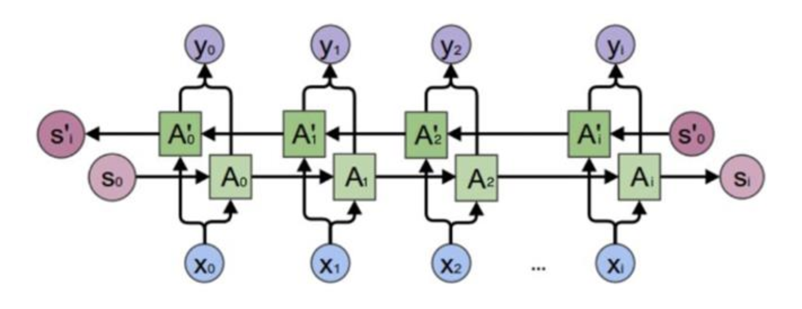
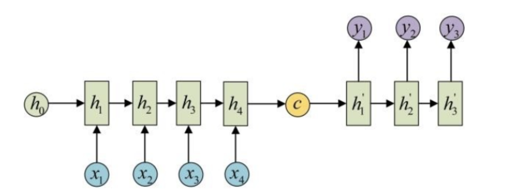
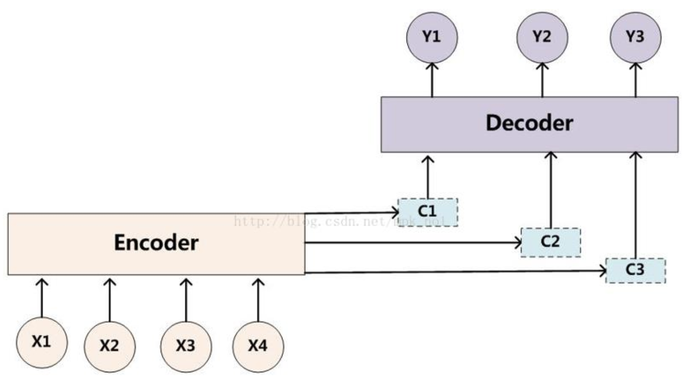
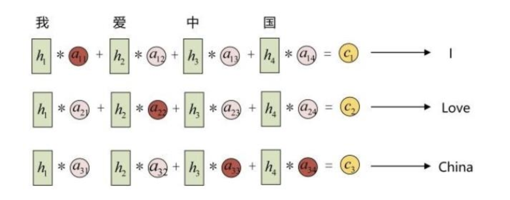

#### Simple RNN 实现方法

在 TensorFlow 中，通常采用如下方式实现 SimpleRNN。

**1.** 数据转换成 RNN 网络输入格式数据，通常为（Batchsize，num_step，feature_len）。

**2.** 采用如下函数定义 rnn_cell：

```
        rnn_cell = tf.contrib.rnn.BasicRNNCell(state_size)
```

**3.** 采用如下函数定义 RNN 模型：

```
        rnn_outputs, final_state = tf.contrib.rnn.static_rnn(cell, rnn_inputs,     initial_state=init_state)//静态构建
        rnn_outputs, final_state = tf.nn.dynamic_rnn(cell, rnn_inputs,     initial_state=init_state) //动态构建
```

另外，可以考虑采用直接实现 SimpleRNN 内部逻辑的方式来定义 RNN 层，具体如下：

```
    def rnn_cell(rnn_input, state):
        with tf.variable_scope('rnn_cell', reuse=True):
            W = tf.get_variable('W', [num_classes + state_size, state_size])
            b = tf.get_variable('b', [state_size], initializer=tf.constant_initializer(0.0))
        return tf.tanh(tf.matmul(tf.concat([rnn_input, state], 1), W) + b)
```

另外，可以定义多层 RNN 结构，代码如下：

```
rnn_cell = rnn.BasicRNNCell(num_units=hidden_size, forget_bias=1.0, state_is_tuple=True) 
#定义：dropout layer
rnn_cell = rnn.DropoutWrapper(cell=rnn_cell, input_keep_prob=1.0, output_keep_prob=keep_prob) 
#定义多层 RNN
mrnn_cell = rnn.MultiRNNCell([rnn_cell] * layer_num, state_is_tuple=True) 
#来初始化
init_state = mlstm_cell.zero_state(batch_size, dtype=tf.float32) 
#动态构建RNN
outputs, state = tf.nn.dynamic_rnn(mrnn_cell, inputs=X, initial_state=init_state, time_major=False)
```

### 双向 RNN 网络模型

#### 双向 RNN 模型概述

从模型结构来看，SimpleRNN 主要利用了历史信息对未来信息进行预测。

如何利用上下文信息对后续的任务预测，明显是更加值得研究的点。比如 OCR 识别任务中，字母和字母之间往往存在一定的关联性，充分利用上下文之前的关联性，明显有利于识别任务的完成。双向 RNN 网络，主要用来解决此类识别问题。

双向循环神经网络（BRNN）的设计初衷就是利用上下文信息，利用两个顺序相反的单向 RNN 网络来完成模型的预测任务。此处的相反是指对输入时间序列进行反向，最终将两个方向在同一个时间序列节点上的输出进行连接得到最后的输出。这样就能够挖掘出时间序列中的上下文关系。具体结构如下图所示：



在 TensorFlow 中，通常采用如下方式定义双向 RNN 层，如下所示：

```python
bidirectional_dynamic_rnn( 
    cell_fw: 前向的rnn cell , 
    cell_bw：反向的rnn cell , 
    inputs：输入的序列 , 
    sequence_length=None , 
    initial_state_fw=None：前向rnn_cell的初始状态 , 
    initial_state_bw=None：反向rnn_cell的初始状态 , 
    dtype=None , 
    parallel_iterations=None ,
    swap_memory=False, 
    time_major=False, scope=None) 
```

其中，cell_fw 和 cell_bw 定义为上述的 SimpleRNN 单元，也可以定义为后续将要介绍到的 LSTM 单元。

另外，多层双向 RNN 网络通常定义如下：

```
for _ in range(num_layers):
    with tf.variable_scope(None, default_name="bidirectional-rnn"):
    rnn_cell_fw = RNN(num_units)
    rnn_cell_bw = RNN(num_units)
    initial_state_fw = rnn_cell_fw.zero_state(batch_size, dtype=tf.float32)
    initial_state_bw = rnn_cell_bw.zero_state(batch_size, dtype=tf.float32)
    (output, state) = tf.nn.bidirectional_dynamic_rnn(rnn_cell_fw, rnn_cell_bw, _inputs, seq_lengths,initial_state_fw, initial_state_bw, dtype=tf.float32)
    _inputs = tf.concat(output, 2)
```

### 从序列到序列问题——Seq2Seq+Attention 机制

上述介绍的网络结构 Simple RNN、LSTM、GRU，大多用于预测、识别、分类任务。对于一些诸如机器翻译、自动对话此类序列到序列的任务而言，通常效果不佳。主要原因在于，RNN 网络在对信息进行编码时，通常要求固定长度的输入，且序列长度不易过长。而序列到序列的任务，则要求输入和输出存在不同长度，且输出内容对于输入序列的依赖程度不同。而 Seq2Seq+Attention 模型则成为此类任务的重要解决手段。

通常 Seq2Seq 的网络结构如下所示：



其中，左半部分为编码器部分，右半部分则为解码器部分。编码器部分对输入信息进行编码，也就是所谓的特征抽取，而解码器部分则是对抽取出的特征进行解码，得到后续的输出。

Seq2Seq 网络通常会将编码之后的输出作为后续解码的输入。然而，仅仅使用编码后的结果，会遗失很多信息，且解码的过程仅仅同最后一个状态有关，而丢失了与其他状态的关联。Attention 机制的引入则是通过对不同序列时刻上的信息进行重要性表示，进而建立彼此之间的联系，具体结构如下所示：



其中，每一个 C（C1、C2、C3）会自动选取与当前所要输出的 Y（Y1、Y2、Y3）最合适的上下文信息。以机器翻译为例，展开后表示如下：




#### CTC Loss

在实际工程任务中，Seq2Seq 模型与传统 RNN 模型相比，除结构上的差异以外，另一个主要区别就在 Loss 的定义上。如果模型预测出的结果只是模型 Label 的一部分时，则要对预测出的 Label 做一些处理后，才可以得到我们最终想要的结果。直接采用传统 Loss，很难表示这种关系。因此，在序列任务中，通常采用 CTC Loss ，来计算预测结果和 Label 之间差异，并用于反向传播。

CTC 的全称是 Connectionist Temporal Classification，主要用来解决输出结果同标注信息不对齐的问题，同样用于和序列相关的任务中，比如 OCR 识别、语音识别、机器翻译等。例如，在语音识别任务中，通常采用窗口的方式对每个子窗口进行识别，此时就可能预测出重复的字母。将“wworrrlldd”这样的预测结果，解码为“world”，就需要用到 CTC 算法。

在 TensorFlow 中，通常调用如下函数直接定义 CTC Loss：

```
tf.nn.ctc_loss(labels, inputs, sequence_length, preprocess_collapse_repeated=False, ctc_merge_repeated=True, time_major=True) {#ctc_loss}
```

了解 CTC Loss 更多内容，推荐阅读《[NLP 之 CTC Loss 的工作原理](https://www.jianshu.com/p/e073c9d91b20)》