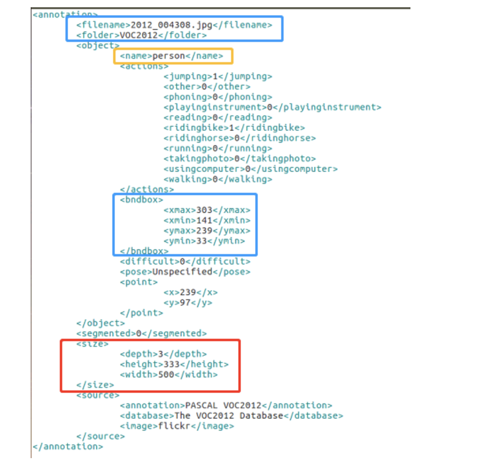

#### Pascal VOC 数据集概述

计算机视觉领域有三大任务，即图像分类、目标检测与分割。图像分类是指将图像中某个物体划分到某一类别（打一个标签）中，通常对应到图像中最突出的物体。然而，在自然场景下或实际生活中，大多数图像通常包含非常多的物体，如果采用图像分类模型为图像分配一个单一标签并不准确。因此，需要采用目标检测模型对图像中的多个物体进行检测，定位出物体的位置信息，并给出类别标签。目标检测方法在很多领域都有重要的应用价值，比如安防领域、ADAS 场景等。

#### Pascal VOC 数据集格式

解压后会发现如下几个文件夹，它们分别对应图片、标注数据等内容，具体描述如下。

- Annotation 保存着 XML 格式的 Label 信息。
- ImageSet 下的 Main 目录中存放着用于训练的图片集合，其中：
  - train.txt 存放着用于训练的图片文件的文件名列表。
  - val.txt 存放着用于验证的图片文件的文件名列表。
  - trianval.txt 存放着用于训练和验证的图片文件的文件名列表。
- JPECImages 目录下存放着所有的图片集，图片集中图片的名字通常与 Annotation 中的文件名保持一致。

Annotation 对应的标注文件如下所示：



其中，filename 对应图片文件名，folder 对应数据集文件夹名，name 对应当前图片所属类别，bndox 对应坐标信息，size 对应图片大小，source 对应数据集一些额外的描述信息。

一个生成 Annotation 文件的 Python 脚本。

```python
from xml.dom.minidom import Document
import os
def create(folderName, xmlPath, xmlName, pictureName, imgSize, datas):
    ## 写 XML 文件
    xmlpath = xmlpath + xmlName
    folder_name = os.path.dirname(xmlpath)
    if not os.path.exists(folder_name):
        os.makedirs(folder_name)
    f = open(xmlpath, "w")
    doc = Document()
    annotation = doc.createElement('annotation')
    doc.appendChild(annotation)
    folder = doc.createElement('folder')
    folder.appendChild(doc.createTextNode(foldername))
    annotation.appendChild(folder)
    filename = doc.createElement('filename')
    filename.appendChild(doc.createTextNode(pictureName.split('/')[-1]))
    annotation.appendChild(filename)

    source = doc.createElement('source')
    database = doc.createElement('database')
    database.appendChild(doc.createTextNode('My Database'))

    source.appendChild(database)
    source_annotation = doc.createElement('annotation')
    source_annotation.appendChild(doc.createTextNode(foldername))
    source.appendChild(source_annotation)
    image = doc.createElement('image')
    image.appendChild(doc.createTextNode('flickr'))
    source.appendChild(image)
    flickrid = doc.createElement('flickrid')
    flickrid.appendChild(doc.createTextNode('NULL'))
    source.appendChild(flickrid)
    annotation.appendChild(source)
    owner = doc.createElement('owner')
    flickrid = doc.createElement('flickrid')
    flickrid.appendChild(doc.createTextNode('NULL'))
    owner.appendChild(flickrid)
    name = doc.createElement('name')
    name.appendChild(doc.createTextNode('idaneel'))
    owner.appendChild(name)
    annotation.appendChild(owner)
    size = doc.createElement('size')
    width = doc.createElement('width')
    width.appendChild(doc.createTextNode(str(imgSize[1])))
    size.appendChild(width)
    height = doc.createElement('height')
    height.appendChild(doc.createTextNode(str(imgSize[0])))
    size.appendChild(height)

    depth = doc.createElement('depth')
    depth.appendChild(doc.createTextNode(str(imgSize[2])))
    size.appendChild(depth)
    annotation.appendChild(size)
    segmented = doc.createElement('segmented')
    segmented.appendChild(doc.createTextNode(str(0)))
    annotation.appendChild(segmented)
    annotation.appendChild(insertObject(doc, datas))
    f.write(doc.toprettyxml(indent='    '))
    f.close()


def insertObject(doc, datas):
    # print("datas.type:", type(datas))
    obj = doc.createElement('object')
    name = doc.createElement('name')
    name.appendChild(doc.createTextNode("word"))
    obj.appendChild(name)
    pose = doc.createElement('pose')
    pose.appendChild(doc.createTextNode('Unspecified'))
    obj.appendChild(pose)
    truncated = doc.createElement('truncated')
    truncated.appendChild(doc.createTextNode(str(0)))
    obj.appendChild(truncated)
    difficult = doc.createElement('difficult')
    difficult.appendChild(doc.createTextNode(str(0)))
    obj.appendChild(difficult)
    bndbox = doc.createElement('bndbox')

    xmin = doc.createElement('xmin')
    xmin.appendChild(doc.createTextNode(str(datas[0])))
    bndbox.appendChild(xmin)

    ymin = doc.createElement('ymin')
    ymin.appendChild(doc.createTextNode(str(datas[1])))
    bndbox.appendChild(ymin)
    xmax = doc.createElement('xmax')
    xmax.appendChild(doc.createTextNode(str(datas[2])))
    bndbox.appendChild(xmax)
    ymax = doc.createElement('ymax')
    ymax.appendChild(doc.createTextNode(str(datas[3])))
    bndbox.appendChild(ymax)
    obj.appendChild(bndbox)
    return obj
```

其中，create 函数完成了数据调用过程：

```
create(folderName, xmlPath, xmlName, pictureName, imgSize, datas)；
```

参数含义解释如下。

- foldername：根目录文件夹名。
- xmlpath：Annotation 对应的路径。
- xmlName：标注文件对应的 XML 文件名。
- pictureName：图片名。
- imgSize：图片的 shape[h,w,c]。
- datas：对应标注信息 [xmin,ymin,xmax,ymax]。

#### SSD 算法原理简述

基于深度学习的目标检测算法目前主要分为两大类，即 One-Stage 目标检测算法和 Two-Stage 目标检测算法。Two-Stage 目标检测算法主要以 Faster R-CNN 系列算法为主，而 One-Stage 目标检测算法则以 YOLO 系列算法和 SSD 系列算法为主。两者的主要区别在于是否包括利用 RPN 网络完成 Bounding Box 推荐这一过程。在 Two-Stage 中，首先需要训练 RPN 网络，然后再训练整个网络，训练过程要比 One-Stage 繁琐，且 Inference 时间较长。

SSD 算法采用了 FFaster R-CNN 系列算法中的 Anchor 机制，属于 One-Stage 目标检测算法，实现了 End-End 的训练和预测，在保证精度的同时，能实现较快的目标检测速度。对实时任务而言，它更具有价值。

SSD 模型的网络结构如下图所示：


该结构包含了主干网络、多尺度特征提取、以及 Detection Out 层几大部分，最后通过 NMS 算法对输出结果进行过滤和筛选。对 Bounding-Box 的预测，主要在 Detection Out 层进行回归预测，同时对检测目标进行分类。